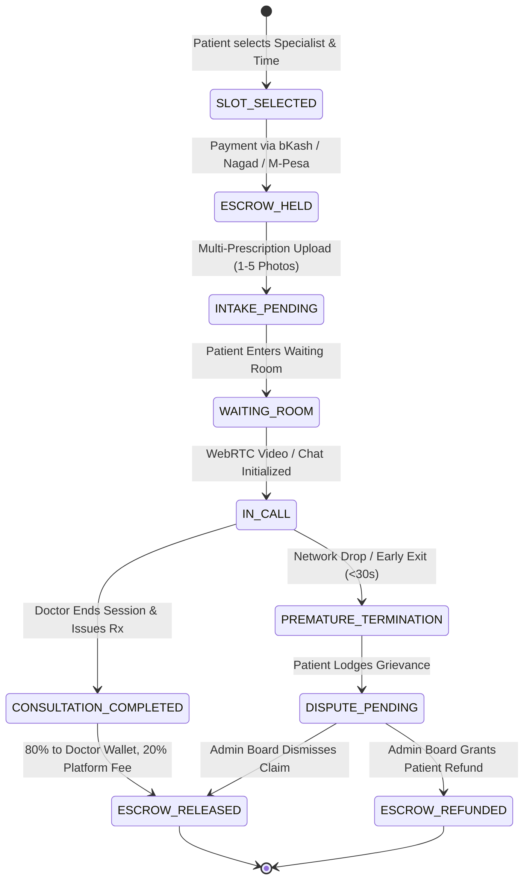
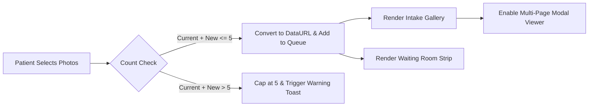
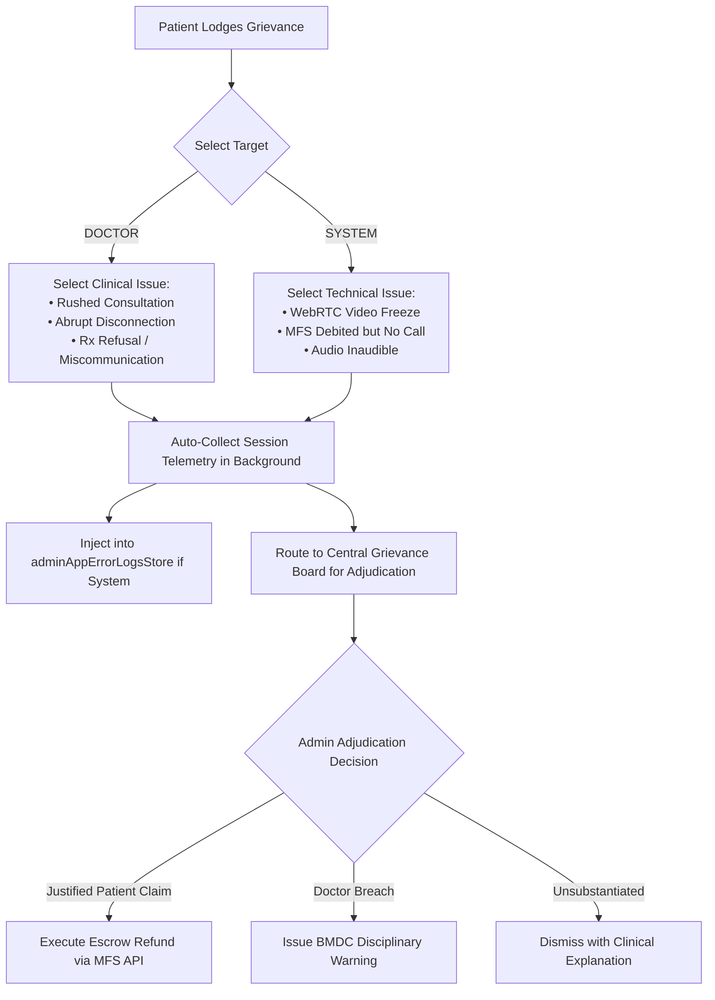
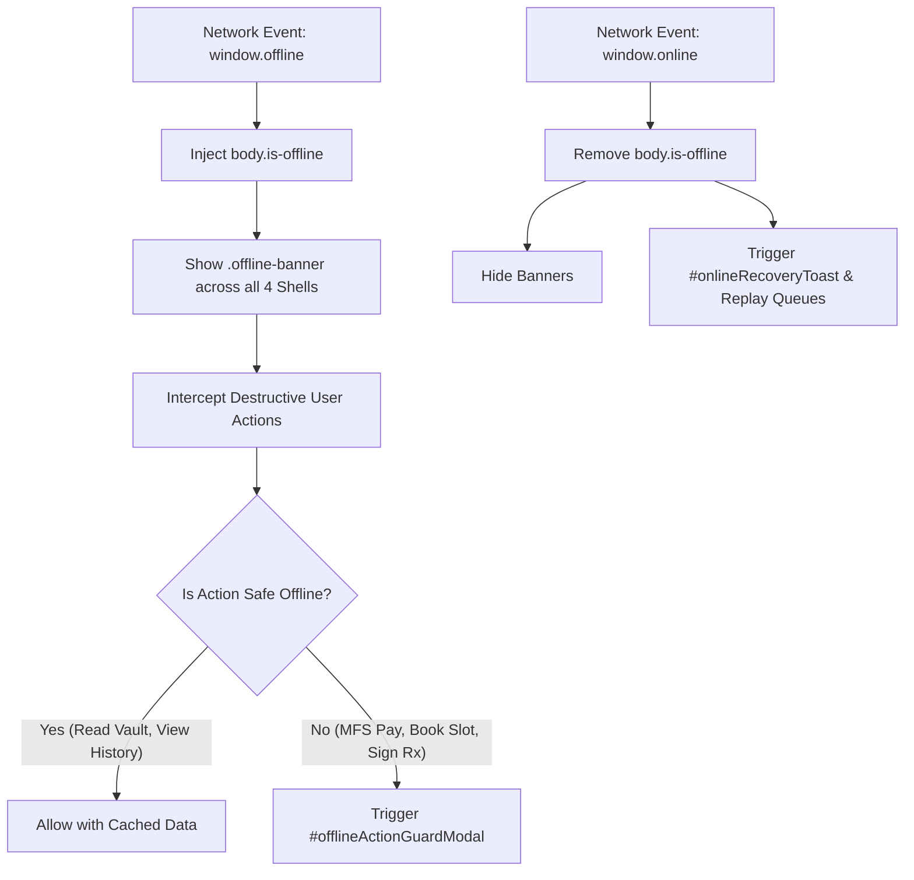

# HelloDoctor (HeloDoc) — Complete System Business Logic & Operational Architecture Specification

> **Version:** 2.4.0  
> **Target Deployments:** Web (Mobile-First SPA), Desktop Clinical Workstation, Central Administration Portal  
> **Primary Jurisdiction & Markets:** Bangladesh (BMDC / DGDA Compliance) & East Africa / Kenya (English & Swahili Localization, M-Pesa / Mobile Financial Services)  
> **Source Repository:** `MeherabHS/hellodoctor`  
> **Core Web Entry Point:** `index.html` (served via GitHub Pages)

---

## Table of Contents

1. [Executive Summary & System Philosophy](#1-executive-summary--system-philosophy)
2. [High-Level Architecture & Multi-Portal Ecosystem](#2-high-level-architecture--multi-portal-ecosystem)
3. [Actors, Roles & Lifecycle State Machine](#3-actors-roles--lifecycle-state-machine)
4. [End-to-End Business Logic & Workflows](#4-end-to-end-business-logic--workflows)
   - [4.1 Patient Onboarding & Specialist Discovery](#41-patient-onboarding--specialist-discovery)
   - [4.2 Appointment Scheduling & Slot Allocation](#42-appointment-scheduling--slot-allocation)
   - [4.3 Multi-Prescription Intake Engine (Max 5 Images)](#43-multi-prescription-intake-engine-max-5-images)
   - [4.4 Virtual Waiting Room & Device Readiness](#44-virtual-waiting-room--device-readiness)
   - [4.5 Live Teleconsultation (WebRTC Video & 24h Clinical Chat)](#45-live-teleconsultation-webrtc-video--24h-clinical-chat)
   - [4.6 DGDA-Compliant E-Prescription & Longitudinal Health Vault](#46-dgda-compliant-e-prescription--longitudinal-health-vault)
   - [4.7 Clinical Grievance Redressal & Star-Rating Elimination](#47-clinical-grievance-redressal--star-rating-elimination)
   - [4.8 Doctor Earnings & 20% Debarred Settlement Engine](#48-doctor-earnings--20-debarred-settlement-engine)
   - [4.9 Emergency Contact Helpline System](#49-emergency-contact-helpline-system)
   - [4.10 Bilingual Localization Engine (English & Swahili)](#410-bilingual-localization-engine-english--swahili)
   - [4.11 Offline Resilience, Network Guarding & Shimmer Loading](#411-offline-resilience-network-guarding--shimmer-loading)
5. [Central Admin Operations & Governance Subsystems](#5-central-admin-operations--governance-subsystems)
   - [5.1 Executive Command Center](#51-executive-command-center)
   - [5.2 Doctor Directory & Physician Dossiers](#52-doctor-directory--physician-dossiers)
   - [5.3 Patient Directory & Clinical History](#53-patient-directory--clinical-history)
   - [5.4 BMDC Licensing & Credentialing Engine](#54-bmdc-licensing--credentialing-engine)
   - [5.5 Telehealth Slot & Capacity Management](#55-telehealth-slot--capacity-management)
   - [5.6 Clinical Protocol & Compliance Oversight](#56-clinical-protocol--compliance-oversight)
   - [5.7 App Incident Diagnostics & Telemetric Error Logs](#57-app-incident-diagnostics--telemetric-error-logs)
   - [5.8 Grievance Arbitration & Disciplinary Adjudication](#58-grievance-arbitration--disciplinary-adjudication)
   - [5.9 Omnichannel Payment & Escrow Master Ledger](#59-omnichannel-payment--escrow-master-ledger)
6. ["What Does What" Component & Screen Reference Matrix](#6-what-does-what-component--screen-reference-matrix)
   - [6.1 Patient Mobile Viewports (`view-0` to `view-14`)](#61-patient-mobile-viewports-view-0-to-view-14)
   - [6.2 Doctor Mobile Viewports (`doc-view-0` to `doc-view-5`)](#62-doctor-mobile-viewports-doc-view-0-to-doc-view-5)
   - [6.3 Doctor Web Clinical Workstation (`#doctorWebShell`)](#63-doctor-web-clinical-workstation-doctorwebshell)
   - [6.4 Central Admin Pages (`adminPage_*`)](#64-central-admin-pages-adminpage_)
   - [6.5 Interactive System Modals](#65-interactive-system-modals)
7. [In-Memory State Stores & Telemetry Schemas](#7-in-memory-state-stores--telemetry-schemas)
8. [Failure Modes, Security Guards & Edge Case Handling](#8-failure-modes-security-guards--edge-case-handling)

---

## 1. Executive Summary & System Philosophy

**HelloDoctor (HeloDoc)** is an enterprise mHealth and Teleconsultation platform built to bridge primary, specialized, and emergency healthcare gaps across developing and emerging markets. Originally architected for Bangladesh and expanded for East African telecare (Kenya), the system balances consumer accessibility with medical governance.

### Core Guiding Principles

1. **Elimination of Subjective Star Ratings (Zero Commercialization)**:
   - Traditional e-commerce rating paradigms (5-star reviews, thumbs up, popularity algorithms) are strictly prohibited across all patient-facing surfaces.
   - Physician quality is governed by **BMDC (Bangladesh Medical and Dental Council)** credentialing, years of certified clinical practice, and institutional affiliations.
   - Patient dissatisfaction is handled through an evidence-based **Grievance Redressal Board** rather than public vanity scores.

2. **Transparent Financial Debarment (20% Platform Fee Model)**:
   - Doctors maintain clear visibility into their earnings. Gross earnings are never displayed in isolation without debarring the platform charge first.
   - The platform strictly enforces a 3-step calculation:
     $$\text{Total Gross Earnings} \longrightarrow \text{20\% Debarred Platform Charge} \longrightarrow \text{Final Net Take-Home}$$
   - Every summary explicitly states the calculation basis to avoid physician disputes.

3. **Multi-Source Clinical Intake (Up to 5 Prescription Images)**:
   - Patients in target markets frequently hold handwritten prescriptions, physical diagnostic reports, and discharge slips.
   - The platform allows patients to upload between **1 and 5 high-resolution physical documents** before joining the consultation, providing physicians with immediate multi-page document inspection.

4. **Bilingual Regional Localization**:
   - The patient interface supports instantaneous toggling between **English** and **Swahili (Kiswahili)**, accommodating cross-border deployment in Kenya and East Africa alongside standard English medical workflows.

5. **2G/3G Bandwidth Resilience & Offline Action Guarding**:
   - Built to operate seamlessly over fluctuating cellular connections. Destructive state changes (payments, appointment confirmations, prescription signing) are locked behind offline action guards, while non-blocking background telemetry syncs when connectivity resumes.

---

## 2. High-Level Architecture & Multi-Portal Ecosystem

The system operates as an integrated Single-Page Application (SPA) driven by an interactive shell switcher. All four portals share common telemetry, real-time data stores, and event buses.

```
                                  ┌────────────────────────────────────────┐
                                  │      HELODOC CORE EVENT BUS & STORES   │
                                  └───────────────────┬────────────────────┘
                                                      │
         ┌────────────────────────┬───────────────────┴────────────────┬────────────────────────┐
         │                        │                                    │                        │
         ▼                        ▼                                    ▼                        ▼
┌──────────────────┐    ┌──────────────────┐                 ┌──────────────────┐    ┌────────────────────┐
│ PATIENT SHELL    │    │ DOCTOR MOBILE    │                 │ DOCTOR WORKSTATION│   │ CENTRAL ADMIN      │
│ (#patientAppShell)│   │ (#doctorAppShell)│                 │ (#doctorWebShell)│    │ (#adminPortalShell)│
├──────────────────┤    ├──────────────────┤                 ├──────────────────┤    ├────────────────────┤
│ • 15 Mobile Views│    │ • 6 Mobile Views │                 │ • Dual EMR Split │    │ • 9 Operations Pgs │
│ • 1-5 Rx Upload  │    │ • 20% Fee Wallet │                 │ • 1080p Telehealth│   │ • Escrow Ledger    │
│ • Swahili/English│    │ • 24h Chat Desk  │                 │ • Cloud Rx Engine│    │ • BMDC Dossiers    │
│ • Emergency 16263│    │ • Smart Rx Scan  │                 │ • Revenue Center │    │ • Grievance Board  │
└──────────────────┘    └──────────────────┘                 └──────────────────┘    └────────────────────┘
```

### Viewport Switching Logic
The active workspace is managed by `wbSwitchShell(targetShell)`:
- `'patient'`: Activates mobile patient container (`#patientAppShell`), displaying primary patient navigation and tab bar.
- `'doctor'`: Activates mobile doctor container (`#doctorAppShell`), presenting physician queue, chats, schedule, and wallet.
- `'doctor-web'`: Activates desktop clinical workstation (`#doctorWebShell`) featuring dual-pane teleconsultation.
- `'admin'`: Activates central governance command center (`#adminPortalShell`) for oversight and dispute adjudication.

---

## 3. Actors, Roles & Lifecycle State Machine

### 3.1 Platform Actors

| Actor | Identification | Permissions | Core Responsibilities |
|---|---|---|---|
| **Patient** | Phone number, National ID / Clinical MRN | Read doctor directory, book slots, upload 1–5 Rx images, engage in video/chat, lodge grievances, access health vault | Seeks medical consultations, provides medical history, manages family profiles |
| **Physician** | BMDC Registration Number, National ID | Set availability, join calls, review multi-image records, author e-prescriptions, track 20% debarred wallet earnings | Conducts clinical assessments, authors legal digital prescriptions, monitors patient follow-ups |
| **Central Admin** | Secure Superuser / Governance Credentials | Full CRUD over physician rosters, escrow ledger management, BMDC validation, grievance adjudication, system log diagnostics | Clinical governance, fraud prevention, dispute settlement, MFS payment reconciliation |

### 3.2 Consultation Lifecycle State Machine



---

## 4. End-to-End Business Logic & Workflows

### 4.1 Patient Onboarding & Specialist Discovery

1. **User Landing & Header**:
   - The patient arrives at `view-0` (Home Dashboard), greeted with their name, profile shortcut, and quick-action health status.
2. **Specialist Filtering (`view-3`)**:
   - Patients filter doctors by:
     - **Modality**: All Doctors, Instant Chat, or Live Video Consultation (`setDoctorDirectoryModality`).
     - **Medical Specialty**: Internal Medicine, Cardiology, Dermatology, Pediatrics, Gynecology, etc. (`filterDoctorBySpecialty`).
3. **Clinical Credential Display**:
   - Doctor cards explicitly showcase:
     - Full Name and BMDC Registration Number (e.g., `BMDC #45821`).
     - Clinical Experience (e.g., `12 Years Exp`).
     - Hospital / Institutional Affiliation (e.g., `Dhaka Medical College Hospital`).
     - Transparent Consultation Fees (e.g., Video: `৳ 800`, Chat: `৳ 500`).
     - No star rating badges or subjective review counts are displayed.

---

### 4.2 Appointment Scheduling & Slot Allocation

1. **Date & Slot Selection (`view-4`)**:
   - The booking interface presents available calendar dates and dynamically generated 15-minute or 20-minute clinical slots.
   - Slots are categorized into Morning, Afternoon, and Evening sessions.
2. **Escrow Payment Authorization**:
   - The patient selects a Mobile Financial Services (MFS) provider: **bKash**, **Nagad**, or **Card / M-Pesa**.
   - Consultation fees are placed in an **Escrow Holding State** (`adminTransactionStore`). The funds are not credited to the physician until the consultation is completed successfully.

---

### 4.3 Multi-Prescription Intake Engine (Max 5 Images)

Patients frequently require consultation for chronic conditions or second opinions, requiring multiple physical prescriptions, lab reports, and diagnostic scans.



1. **Upload Constraints**:
   - The file input (`#patientPreConsultFileInput`) supports multiple file selections (`accept="image/*,application/pdf" multiple`).
   - Maximum allowed uploads: **5 files total** (`MAX_PRESCRIPTION_IMAGES = 5`).
   - If a patient attempts to select more than 5 images, the intake engine accepts files up to the limit and displays a warning toast:
     > *"Maximum 5 prescription photos allowed. Extra photos were omitted."*
2. **Live Gallery & Thumbnail Management (`#patientPrescriptionGalleryContainer`)**:
   - Each uploaded file is rendered with:
     - Thumbnail preview.
     - Document index label (e.g., `Prescription Page 1 of 3`).
     - File size badge (e.g., `1.2 MB`).
     - Delete action (`removePatientPrescriptionImage(index)`), allowing the patient to remove and replace photos prior to entering the consultation.
3. **Cross-View Synchronization**:
   - The uploaded collection immediately populates the **Waiting Room Strip** (`#wrPrescriptionThumbnailsStrip`) and the **Multi-Page Inspection Modal** (`#pdfMultiPageBar`).

---

### 4.4 Virtual Waiting Room & Device Readiness

1. **Waiting Room Dashboard (`view-10`)**:
   - Displays real-time queue position (e.g., `You are next in line`), scheduled start time, and a live countdown timer.
2. **Device Hardware Pre-Flight Check**:
   - Tests local camera, microphone, and WebRTC peer connection compatibility.
   - Successful tests trigger confirmation toasts:
     > *"Camera & Mic Ready: Your device permissions are ready for the consultation."*
3. **Pre-Consultation Document Inspection**:
   - Allows patients to review their uploaded prescriptions using the **Multi-Page Prescription Viewer** (`openMultiPagePrescriptionViewer(pageIndex)`), navigating between pages with previous/next controls (`#btnPrevRxPage`, `#btnNextRxPage`).

---

### 4.5 Live Teleconsultation (WebRTC Video & 24h Clinical Chat)

#### A. WebRTC Video Teleconsultation
- **Resolution**: Adaptive 720p / 1080p WebRTC stream with fallback to audio-only if bandwidth drops below 128 kbps.
- **Session Telemetry Engine**:
  - Automatically records call connection events, ICE candidate states, packet loss, and actual call duration (`callSeconds`).
  - Distinguishes between completed clinical consultations and premature call drops (<30 seconds).

#### B. 24-Hour Time-Boxed Clinical Chat (`view-6` / `doc-view-4`)
- Post-video consultation, a **24-hour asynchronous chat window** activates.
- **Clinical Chat Rules**:
  - Used for clarifying prescription dosage, lab test queries, and drug reaction checks.
  - Automatically locks after 24 hours to prevent unmanaged, out-of-scope clinical liability.
  - Includes quick-response templates for doctors:
    - *"Please take the medicine after meals."*
    - *"Upload the CBC report as soon as available."*
    - *"If fever persists beyond 48 hours, visit an emergency clinic."*

---

### 4.6 DGDA-Compliant E-Prescription & Longitudinal Health Vault

1. **Digital Prescription Authoring (`doc-view-1` / `#doctorWebShell`)**:
   - Physicians generate digitally signed prescriptions containing:
     - Doctor details: Name, Qualifications, BMDC Number, Digital Signature Hash.
     - Patient details: Name, Age, Gender, Weight, Blood Pressure, Clinical Complaints.
     - Rx Drugs: Brand name, generic molecule (DGDA verified), dosage form (tablet, syrup, injection), frequency (`1+0+1`), duration (`5 days`), and instructions (`After meals`).
     - Diagnostic investigations required (e.g., `CBC with ESR`, `Serum Creatinine`).
2. **Health Vault Storage (`view-5`)**:
   - Issued prescriptions are archived in the patient's encrypted longitudinal Health Vault (`#patientHealthVault`).
   - Patients can download official PDFs, share records with consulting specialists, or route medications directly to partner pharmacies for home delivery.

---

### 4.7 Clinical Grievance Redressal & Star-Rating Elimination

To uphold medical ethics and prevent defamatory or commercialized review spam, HelloDoctor uses a structured **Clinical Grievance Redressal System** in place of customer star ratings.



#### Grievance System Business Rules

1. **Strict Removal of Star Ratings**:
   - Zero star characters (`⭐`, `★`) or vanity score counters exist anywhere in the application.
2. **Direct Incident Categorization**:
   - **Complaints against DOCTOR**:
     - *Rushed Consultation / Ended Abruptly (< 3 minutes)*
     - *Doctor Did Not Issue Prescription After Call*
     - *Unprofessional Clinical Conduct / Miscommunication*
     - *Doctor Was Inattentive / Late to Session*
   - **Complaints against SYSTEM**:
     - *WebRTC Video / Audio Freeze During Consultation*
     - *bKash Payment Debited But Session Failed to Launch*
     - *Camera / Microphone Permission Trapped in Loop*
     - *Prescription PDF Failed to Generate / Download*
3. **Telemetry Auto-Collection**:
   - The patient grievance modal (`#patientGrievanceModal`) automatically binds to the consultation's forensic telemetry record:
     - Exact call duration (`callDuration`, e.g., `0m 15s`).
     - Network connection status (`Stable 4G` vs. `ICE Failed`).
     - Prescription issuance status (`Issued` vs. `Not Issued`).
     - Escrow payment ID (`TXN-BK-94812`).
     - Chronological event timeline (e.g., `Room Created -> Peer Joined -> Connection Drop`).
4. **Patient Privacy & Experience Rule**:
   - Raw technical diagnostics are captured silently in the background and hidden on the patient end (`aria-hidden="true"`, `style="display:none;"`), preventing confusing diagnostic dumps while providing the Admin Board with full forensic visibility.
5. **No Punitive Self-Remedy**:
   - Patients describe their experience and upload supporting notes, but cannot dictate arbitrary financial penalties. Adjudication is reserved for the Central Medical Governance Board.

---

### 4.8 Doctor Earnings & 20% Debarred Settlement Engine

To maintain transparency and ensure physicians understand platform deductions, physician earnings are calculated and displayed using a **3-tier debarred platform fee model**.

#### Financial Mathematics

$$\begin{aligned}
\text{Gross Consultation Inflow } (G) &= \sum \text{Fee per consultation} \\
\text{HeloDoc Platform Charge } (C) &= G \times 0.20 \quad (20\%\text{ withheld at settlement}) \\
\text{Final Net Doctor Take-Home } (N) &= G - C = G \times 0.80
\end{aligned}$$

#### User Interface Representation

```
┌────────────────────────────────────────────────────────────────────────┐
│                      DOCTOR WALLET & EARNINGS                         │
├────────────────────────────────────────────────────────────────────────┤
│ Total Earnings (Gross)                       ৳ 35,562.50               │
│ HeloDoc Platform Charge (20% Withheld)     - ৳  7,112.50               │
├────────────────────────────────────────────────────────────────────────┤
│ Final Earning (Net Take-Home)                ৳ 28,450.00               │
├────────────────────────────────────────────────────────────────────────┤
│ ℹ️ Total calculation is based including the platform charge 20%.       │
└────────────────────────────────────────────────────────────────────────┘
```

#### Doctor Financial Rules

1. **Mandatory Basis Statement**:
   - The explanatory note: *"Total calculation is based including the platform charge 20%"* must accompany every earnings card across mobile and desktop workstations.
2. **Itemized Transaction Breakdown**:
   - Every row in the physician's ledger (`#docConsultationsLedgerContainer`) reflects this 3-tier formula:
     - Example: `৳ 800 (Gross) - ৳ 160 (20% Withheld) = ৳ 640 (Final Net)`
3. **Disbursement Channels**:
   - Net earnings are disbursed directly to the physician's verified MFS account (bKash Merchant / Personal or Nagad) with zero hidden payout processing fees.

---

### 4.9 Emergency Contact Helpline System

1. **Strategic Placement on Patient Home Screen (`view-0`)**:
   - The Emergency Contact banner (`#patientEmergencyHelplineStrip`) is located **directly above the Upcoming Consultation card** and immediately below the Core Services grid.
   - This layout ensures patients in acute distress can access emergency services before scrolling through routine appointments.
2. **Wording Standards**:
   - Labeled clearly as **"Emergency Contact"** (the ambiguous *"24/7"* prefix is intentionally excluded).
   - Prominently displays the national emergency healthcare shortcode: **`Call 16263`**.
   - One-tap dialing triggers immediate connection to certified government emergency triage operators (`tel:16263`).

---

### 4.10 Bilingual Localization Engine (English & Swahili)

To support expanding operations in East Africa (Kenya) alongside South Asian deployments, the patient application features an instant, in-memory language switcher.

1. **Supported Languages**:
   - 🇬🇧 **English (en)**: Default clinical international standard.
   - 🇰🇪 **Swahili / Kiswahili (sw)**: Primary regional language for Kenyan and East African patients.
2. **Trigger & Modal (`#languageModal`)**:
   - Accessible from the Patient Account view (`view-7`) via `#patientLangMenuItem`.
   - Displays the current selection using dynamic badge `#patientActiveLangBadge`.
   - Selecting a language updates the interface instantly, saves the preference to `localStorage`, and displays a bilingual confirmation toast:
     > *"Language Updated: Application language switched to Swahili (Kiswahili)."*

---

### 4.11 Offline Resilience, Network Guarding & Shimmer Loading

Given high telecommunication latency and sporadic connectivity in target semi-urban and rural regions, the platform implements comprehensive offline safety guards.



1. **Dual Network State Observers**:
   - Tracks `navigator.onLine` and listens to `window.addEventListener('online')` / `window.addEventListener('offline')`.
   - Updates UI banners across all viewports (`patientOfflineBanner`, `doctorOfflineBanner`, `docWebOfflineBanner`, `adminOfflineBanner`).
2. **Offline Action Guard (`#offlineActionGuardModal`)**:
   - Destructive actions (payment transactions, appointment confirmations, digital prescription dispatches) are blocked while offline to prevent out-of-sync states.
   - Informative alerts advise the user:
     > *"You are currently offline. This action requires an active network connection. Reconnecting..."*
3. **Skeleton Loading Shimmer (`view-14`)**:
   - Dynamic screens display animated skeleton cards (`@keyframes skShimmer`) during data fetches, preventing layout shifts on high-latency 2G/3G connections.

---

## 5. Central Admin Operations & Governance Subsystems

The Central Admin Portal (`#adminPortalShell`) provides oversight across clinical, financial, and operational vectors through 9 core management consoles.

```
┌────────────────────────────────────────────────────────────────────────┐
│                   CENTRAL ADMIN GOVERNANCE CONSOLE                     │
├───────────────┬────────────────────────────────────────────────────────┤
│ NAVIGATION    │ ACTIVE MANAGEMENT VIEWPORT                             │
├───────────────┼────────────────────────────────────────────────────────┤
│ 1. Command    │ Real-time Platform Health, Live Consultations, Alerts  │
│ 2. Doctors    │ Physician Roster, Dossiers, Residence & Phone History  │
│ 3. Patients   │ Patient Directory, Records, Lifetime Consultation GMV  │
│ 4. BMDC       │ Licensing Verification, Expiry Tracker, Credentials    │
│ 5. Slots      │ Platform Capacity Manager, Load-Balancing Schedules    │
│ 6. Compliance │ Clinical Protocol Audits, Prescribing Adherence Logs   │
│ 7. Logs       │ Real-Time Subsystem Error Diagnostics & Simulators     │
│ 8. Grievances │ Dispute Arbitration, Telemetry Evidence, Refund Desk   │
│ 9. Finance    │ Omnichannel Payment & Escrow Master Ledger             │
└───────────────┴────────────────────────────────────────────────────────┘
```

### 5.1 Executive Command Center (`adminPage_command`)
- **Key Performance Indicators (KPIs)**:
  - Active Live Consultations, Available On-Duty Physicians, System Capacity Utilization.
  - 24-Hour GMV, Total Escrow in Holding, Unresolved Grievances, Critical System Incidents.
- **Quick Action Triggers**:
  - Emergency Broadcast Dispatch, Telehealth Capacity Surge Toggle, Master Database Flush.

---

### 5.2 Doctor Directory & Physician Dossiers (`adminPage_doctors`)
- **Master Physician Table**:
  - Detailed listing of all registered specialists with BMDC ID, Specialty, Hospital, Status, and Lifetime Consultations.
- **Comprehensive Physician Dossier Modal (`#adminDoctorHistoryModal`)**:
  - Contains complete operational and contact records:
    - **Phone Number** (e.g., `+880 1711-884920`).
    - **Residential Address** (e.g., `Dhanmondi, Dhaka`).
    - **Official Email** (e.g., `anika.rahman@helodoc.com`).
    - **Consultation History**: Past clinical sessions, patient names, date/time stamps, and session durations.
    - **Disciplinary Record**: Warnings logged by the Grievance Redressal Board.

---

### 5.3 Patient Directory & Clinical History (`adminPage_patients`)
- Tracks registered patients, national health identifiers, verified phone numbers, and emergency contacts.
- Displays patient lifetime value (GMV), completed consultations, open disputes, and family profile links.

---

### 5.4 BMDC Licensing & Credentialing Engine (`adminPage_bmdc`)
- **Verification Portal**:
  - Direct integration with Bangladesh Medical & Dental Council licensing registers.
  - Tracks registration validity dates, medical qualification documents (MBBS, FCPS, MD, MRCP), and specialist certificates.
  - Automatically flags physicians with expiring or disputed medical licenses.

---

### 5.5 Telehealth Slot & Capacity Management (`adminPage_slots`)
- Oversees platform scheduling capacity across specialties.
- Reallocates patient queues during peak hours and enables emergency overflow routing to on-call doctors.

---

### 5.6 Clinical Protocol & Compliance Oversight (`adminPage_compliance`)
- Verifies teleconsultation adherence to Directorate General of Health Services (DGHS) guidelines.
- Monitors prescription completeness: ensures mandatory dosage schedules, duration limits on controlled substances, and digital signature validity.

---

### 5.7 App Incident Diagnostics & Telemetric Error Logs (`adminPage_logs`)
- **Subsystem Coverage**:
  - `MFS_BKASH_GATEWAY`: bKash API webhook failures, signature mismatches, IPN timeouts.
  - `MFS_NAGAD_GATEWAY`: Nagad payment verification drops.
  - `WEBRTC_SIGNALING`: ICE candidate disconnects, STUN/TURN server latency spikes.
  - `DGDA_EMR_SYNC`: Cloud prescription catalog synchronization errors.
- **Incident Detail Modal (`#adminLogDetailModal`)**:
  - Shows full trace IDs (`TRC-94812-BKASH`), affected user accounts, component names, and complete stack traces.
- **Failure Simulator Modal (`#adminSimulateFailureModal`)**:
  - Allows administrators to simulate webhook dropouts, WebRTC timeouts, and gateway failures for system resilience testing.

---

### 5.8 Grievance Arbitration & Disciplinary Adjudication (`adminPage_grievances`)
- **Dispute Docket**:
  - Tracks all open patient claims, categorized by target (`DOCTOR` vs. `SYSTEM`).
- **Forensic Investigation Modal (`#adminGrievanceDetailModal`)**:
  - Displays session telemetry side-by-side with patient statements:
    - Call duration verified against server WebRTC session logs.
    - Packet loss, network drops, and audio codec statistics.
    - Verification of whether a valid prescription was saved to the patient vault.
- **Board Adjudication Actions**:
  - **Disburse Escrow Refund (`btnAdjudicateRefund`)**: Refunds consultation fees back to the patient's MFS wallet (`REFUNDED`).
  - **Issue Disciplinary Warning (`btnAdjudicateWarning`)**: Logs a formal reprimand in the physician's BMDC dossier (`WARNED`).
  - **Dismiss Grievance (`btnAdjudicateResolve`)**: Closes the dispute as resolved when evidence demonstrates compliant care.

---

### 5.9 Omnichannel Payment & Escrow Master Ledger (`adminPage_finance`)
- **Financial Metric Aggregations**:
  - **Gross Merchandise Value (GMV)**: Total patient inflows across all gateways.
  - **Escrow Reserves In-Flight**: Funds held pending consultation completion.
  - **HeloDoc 20% Net Platform Revenue**: Platform commission from completed consultations.
  - **Disbursed Doctor Payouts**: Net 80% earnings paid out to physicians.
- **Reconciliation Engine**:
  - Simulates bulk IPN webhook reconciliation (`reconcileAdminMfsWebhooks`) and provides CSV exports for statutory audits (`exportAdminFinanceLedger`).
- **Transaction Inspector (`#adminTransactionDetailModal`)**:
  - Provides complete audit logs for individual transactions, detailing gateway payloads, platform deductions, and escrow releases.

---

## 6. "What Does What" Component & Screen Reference Matrix

### 6.1 Patient Mobile Viewports (`view-0` to `view-14`)

| View ID | Title / Purpose | Key Elements & DOM Identifiers | User & System Actions |
|---|---|---|---|
| `view-0` | **Patient Home Dashboard** | `#patientEmergencyHelplineStrip`, Upcoming Consultation Card, Core Services 2x2 Grid | Displays greeting, one-tap emergency call (`16263`), upcoming appointment status, and primary navigation buttons. |
| `view-1` | **Core Services Directory** | Single "Book a Specialist Doctor" Card, Instant Chat, Lab Diagnostics, Home Delivery | Routes patients to specialist booking, lab test orders, and medication refills. |
| `view-2` | **Floating Reminders & Triggers** | Toast Consultation Reminder, Medicine Notification Card | Alerts patients to upcoming appointments (30-min warning) and medication schedules. |
| `view-3` | **Find a Specialist Directory** | Modality Selector (`all`, `chat`, `video`), Specialty Filter Chips, Doctor Cards | Filters verified doctors by consultation modality and clinical specialty; displays fees without star ratings. |
| `view-4` | **Date & Slot Booking Engine** | Calendar Carousel, Time Slot Grid, MFS Payment Selector | Selects appointment slots and secures bookings via MFS escrow payments. |
| `view-5` | **Patient Health Vault (EMR)** | Prescription History, CBC Lab Reports, Patient Clinical History | Manages past medical records, downloadable prescription PDFs, and diagnostic reports. |
| `view-6` | **24h Asynchronous Clinical Chat** | Chat Top Bar, Message Feed, Canned Clinical Question Pills | Enables 24-hour post-consultation chat with the consulting doctor for dosage and recovery updates. |
| `view-7` | **Patient Account & Family Profiles** | Family Member Cards, Language Switcher (`#patientLangMenuItem`), Logout Button | Manages dependent profiles, opens Swahili/English language settings, and displays account details. |
| `view-8` | **Consult a Doctor Routing Hub** | Primary Service Cards (Specialist, GP On-Call, Chat Triage) | Directs patients to the appropriate consultation format based on clinical urgency. |
| `view-9` | **Doctor Public Profile** | Doctor Qualifications, BMDC Number, Hospital Affiliation, Availability Tabs | Presents doctor credentials, experience, and consultation options without star ratings. |
| `view-10` | **Virtual Waiting Room** | Countdown Timer, Multi-Prescription Previewer, Audio/Video Pre-Flight Check | Holds patients before sessions, verifies camera/mic readiness, and displays queue status. |
| `view-11` | **Post-Consultation Summary** | Prescription Download Button, Follow-Up Date, Hidden Telemetry Record, Grievance Trigger | Summarizes consultation outcomes and provides access to prescriptions and dispute filing. |
| `view-12` | **Free Health Q&A Community** | Category Filter Chips, Ask Question Form, Answered Forum Feed | Allows patients to ask anonymous questions answered by on-duty medical officers. |
| `view-13` | **Health Blogs & Lifestyle Advice** | Search Input, Category Filter Pills, Verified Medical Blog Posts | Provides health education articles reviewed by BMDC physicians. |
| `view-14` | **Skeleton Loading Shimmer View** | Animated Shimmer Cards (`.sk-shimmer`) | Displays placeholder loading states during high-latency network queries to prevent layout shifts. |

---

### 6.2 Doctor Mobile Viewports (`doc-view-0` to `doc-view-5`)

| View ID | Title / Purpose | Key Elements & DOM Identifiers | User & System Actions |
|---|---|---|---|
| `doc-view-0` | **Doctor Home & Patient Queue** | Duty Toggle (`toggleDoctorDuty`), Patient Queue Tabs (`all`, `upcoming`, `completed`) | Toggles online availability and manages daily patient queues. |
| `doc-view-1` | **Smart Rx Scanner & Dispatch** | Patient Selector Pills, Camera Scan Capture, E-Prescription Form | Digitize handwritten notes, author digital prescriptions, and dispatch records to patient vaults. |
| `doc-view-2` | **Consultation Schedule & Slots** | Date Carousel, Slot Generator (`openSlotGeneratorModal`), Instant Live Triage Toggle | Manages consultation slots, opens emergency appointment windows, and sets availability. |
| `doc-view-3` | **Doctor Wallet & Earnings** | Gross Earnings Card, 20% Fee Debarment Card, Final Net Take-Home Card, Statement Modal | Displays earnings with the 20% platform charge debarred; initiates MFS wallet withdrawals. |
| `doc-view-4` | **24h Consultation Chat Desk** | Conversation Filter Pills, Message Thread, Quick Response Canned Pills | Manages active 24-hour follow-up chats with patients. |
| `doc-view-5` | **Open Health Q&A Triage** | Question Filter Tabs (`open`, `answered`), Clinical Reply Textarea | Allows doctors to answer community health questions, improving community reach. |

---

### 6.3 Doctor Web Clinical Workstation (`#doctorWebShell`)

| Section / Component | DOM Element ID | Functional Capabilities |
|---|---|---|
| **Top Clinical Command Bar** | `#docWebHeader` | Displays doctor status, hospital affiliation, active date, daily revenue KPI with 20% debarment breakdown, and duty toggle. |
| **Teleconsultation Video Console** | `#docWebVideoFeed` | High-definition WebRTC video feed with patient picture-in-picture, mute, camera toggle, and session termination controls. |
| **Longitudinal Patient History** | `#docWebPatientHistory` | Split-screen panel displaying patient medical records, chronic conditions, uploaded multi-prescription photos, and past lab reports. |
| **Cloud E-Prescription Engine** | `#docWebRxComposer` | Generates DGDA-compliant prescriptions with drug auto-completion, dose calculators, and digital signature injection. |
| **Daily Revenue KPI Panel** | `#docWebRevenueWidget` | Shows daily gross revenue, 20% platform deduction, and net final earnings. |

---

### 6.4 Central Admin Pages (`adminPage_*`)

| Page Identifier | DOM Element ID | Business Function & Core Responsibilities |
|---|---|---|
| **Command Center** | `adminPage_command` | Central operations dashboard displaying platform KPIs, active sessions, server load, and emergency controls. |
| **Doctor Management** | `adminPage_doctors` | Physician directory with verified phone numbers, residential addresses, and access to individual dossiers (`#adminDoctorHistoryModal`). |
| **Patient Management** | `adminPage_patients` | Patient user directory displaying account status, consultation history, lifetime value, and dispute records. |
| **BMDC Credentialing** | `adminPage_bmdc` | Medical licensing verification portal managing credential audits, renewal deadlines, and practice suspensions. |
| **Capacity & Slots** | `adminPage_slots` | Platform scheduling manager balancing patient appointment volumes across clinical specialties. |
| **Clinical Compliance** | `adminPage_compliance` | Monitors consultation protocols, teleconsultation session lengths, and prescription guideline adherence. |
| **Error Logs & Diagnostics** | `adminPage_logs` | Subsystem error tracker with interactive failure simulation (`#adminSimulateFailureModal`) and recovery triggers. |
| **Grievance Board** | `adminPage_grievances` | Dispute arbitration desk with session telemetry evidence, escrow refund triggers, and BMDC warning tools. |
| **Finance & Escrow Ledger** | `adminPage_finance` | Master financial ledger tracking gross GMV, escrow balances, 20% platform revenue, and MFS reconciliations. |

---

### 6.5 Interactive System Modals

| Modal ID | Trigger Function | Purpose & User Actions |
|---|---|---|
| `#patientGrievanceModal` | `openPatientGrievanceModal(meta)` | Captures patient complaints against doctors or the system; binds session telemetry silently in the background. |
| `#doctorStatementModal` | `openDoctorStatementModal()` | Displays itemized earnings statements showing gross amounts, 20% deductions, and net payouts per session. |
| `#docConsultationFeeModal`| `openConsultationFeeDetailModal(...)` | Displays fee calculations for individual consultations, showing gross fees, 20% platform charges, and net earnings. |
| `#languageModal` | `openLanguageModal()` | Provides instant language selection between English and Swahili (Kiswahili). |
| `#labReportModal` | `openMultiPagePrescriptionViewer(...)` | Multi-page image viewer for inspecting uploaded prescriptions and lab reports (pages 1 to 5). |
| `#adminDoctorHistoryModal` | `openAdminDoctorHistoryModal(docKey)` | Displays a doctor's full profile: phone number, residence, email, clinical history, and disciplinary warnings. |
| `#adminGrievanceDetailModal`| `openAdminGrievanceDetail(grvId)` | Forensic investigation console displaying session telemetry, WebRTC metrics, and dispute resolution controls. |
| `#adminTransactionDetailModal`| `openAdminTransactionModal(txId)` | Displays detailed transaction breakdowns, payment gateway logs, and escrow settlement states. |
| `#adminLogDetailModal` | `openAdminLogDetail(logId)` | Shows subsystem error traces, stack traces, and options to retry failed operations or disburse refunds. |
| `#adminSimulateFailureModal`| `openAdminSimulateFailureModal()` | Developer/admin tool for simulating payment drops, WebRTC timeouts, and gateway failures. |
| `#offlineActionGuardModal` | Automatic on offline action | Warns users when an action requires an active network connection and prevents out-of-sync operations. |

---

## 7. In-Memory State Stores & Telemetry Schemas

### 7.1 Doctor Earnings Store (`doctorEarningsStore`)
```javascript
{
  doctorName: "Dr. Sabrina Akter",
  bmdc: "BMDC #45821",
  totalGross: 35562.50,           // Step 1: Gross earnings
  platformChargePercent: 20,      // HeloDoc platform fee rate
  withheldFee: 7112.50,           // Step 2: 20% platform charge
  finalNet: 28450.00,             // Step 3: Final net take-home
  calculationBasisNote: "Total calculation is based including the platform charge 20%.",
  consultations: [
    {
      id: "CONS-9481",
      patient: "Rafiq Ahmed",
      date: "Today, 10:30 AM",
      service: "Video Consultation (10 min)",
      gross: 800.00,
      withheld: 160.00,           // 20% deduction
      net: 640.00,                // Net take-home
      trxId: "BK-MER-7718290",
      status: "Settled"
    }
  ]
}
```

### 7.2 Patient Grievance & Dispute Record (`adminPatientGrievancesStore`)
```javascript
{
  id: "GRV-20260930-01",
  target: "DOCTOR",               // "DOCTOR" | "SYSTEM"
  status: "PENDING_REVIEW",       // "PENDING_REVIEW" | "REFUNDED" | "WARNED" | "DISMISSED"
  patientName: "Rafiq Ahmed",
  patientPhone: "+880 1712-345678",
  doctorName: "Dr. Sabrina Akter",
  doctorBmdc: "BMDC #45821",
  consultId: "CONS-9481",
  category: "Rushed Consultation / Ended Abruptly",
  claimSummary: "Doctor stayed only 2 minutes and abruptly disconnected call without prescribing medicine.",
  boardRemedy: "Under Governance Review",
  telemetry: {
    callDuration: "0m 15s",
    callSeconds: 15,
    prematureEnd: true,
    connectionHealth: "Stable 4G (RTT 48ms)",
    webrtcPacketDetails: "ICE Connected, 0% Packet Loss",
    rxVaultStatus: "Not Issued",
    escrowStatus: "Held (৳800 bKash)"
  },
  adjudication: null              // Populated upon Central Board resolution
}
```

### 7.3 Master Transaction & Escrow Record (`adminTransactionStore`)
```javascript
{
  id: "TXN-BK-94812",
  timestamp: "2026-09-30 10:32:15",
  gateway: "bKash",               // "bKash" | "Nagad" | "Card" | "M-Pesa"
  type: "CONSULTATION_INFLOW",
  grossAmount: 800.00,
  platformFee: 160.00,            // 20% Platform Fee
  netAmount: 640.00,              // 80% to Doctor / Refund
  patientName: "Rafiq Ahmed",
  doctorName: "Dr. Sabrina Akter",
  status: "ESCROW_HELD",          // "ESCROW_HELD" | "SETTLED" | "REFUNDED"
  gatewayRef: "BK-IPN-994821038"
}
```

---

## 8. Failure Modes, Security Guards & Edge Case Handling

| Potential Failure Mode | Technical Detection Vector | Automated Mitigation & Clinical Fail-Safe |
|---|---|---|
| **Abrupt Call Termination (< 30s)** | WebRTC PeerConnection `connectionState == 'closed'` and `callSeconds < 30` | Auto-flags session as `prematureEnd: true`. Holds escrow payment and prompts patient with free reconnect or dispute filing options. |
| **MFS Payment Debited But Session Unopened** | IPN Webhook received without matching active session in `adminTransactionStore` | Auto-logs incident to `adminAppErrorLogsStore` under `PatientGrievanceIncidentReporter`. Provides one-click refund in the Admin Portal. |
| **Prescription Photo Upload Overload** | File input selection exceeds `MAX_PRESCRIPTION_IMAGES = 5` | Accepts the first 5 images and ignores remaining files. Displays an explanatory notification toast to prevent memory issues. |
| **Offline Form Submission** | Action triggered while `navigator.onLine === false` | Blocks submission, displays `#offlineActionGuardModal`, and preserves form input until connection is restored. |
| **Prescription Signing Network Drop** | Physician clicks "Sign & Dispatch" while offline | Prevents signature hash generation and warns physician that prescriptions cannot be legally dispatched offline. |
| **Expired BMDC Medical License** | System clock exceeds doctor's license validity date | Disables the physician's appointment booking options and flags the account in `adminPage_bmdc` for administrative review. |
| **Simultaneous Booking Conflict** | Dual booking requests received for the same 15-minute slot | Locks the slot for the first verified payment gateway token and offers alternative slots to the second applicant. |

---

## 9. Conclusion & Operational Compliance

The **HelloDoctor** platform provides an accessible, robust teleconsultation system tailored for emerging healthcare markets. By eliminating subjective star ratings, implementing transparent 20% platform charge calculations, enabling multi-prescription uploads (up to 5 images), supporting bilingual localization (English & Swahili), and maintaining comprehensive offline protections, the platform ensures equitable, transparent, and ethically governed healthcare delivery.
