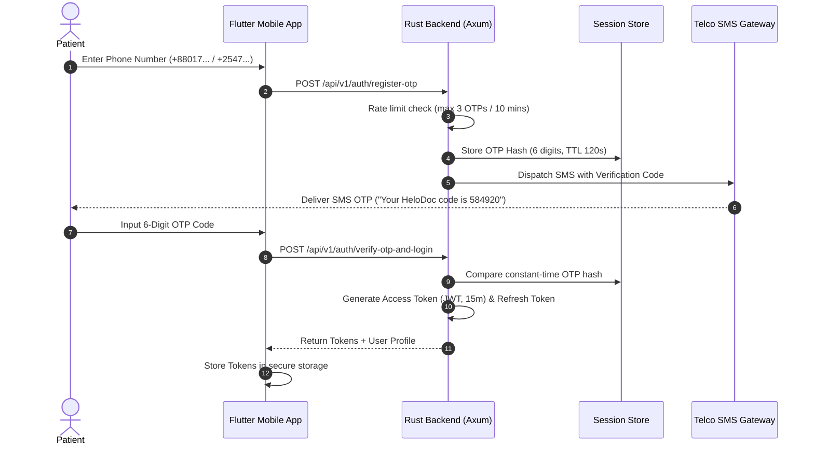

# Phase 8 — Authentication, Authorization & Security Architecture

> **Document Version:** 1.0.0  
> **Security Standards:** HIPAA / GDPR Privacy, OWASP Mobile Top 10, Argon2id Password Hashing, JWT (Ed25519)  
> **Target Audience:** Claude Code Autonomous Implementation Agent

---

## 1. Authentication Lifecycle

### 1.1 Mobile OTP Authentication Flow (Patients)
HelloDoctor uses **Phone Number + OTP** as primary authentication for patients. For physicians, it uses **BMDC Credentials + Password + OTP** (which constitutes a true Multi-Factor Authentication flow).



---

## 2. Token Specifications & Cryptography

### 2.1 Access Tokens
- **Algorithm:** Ed25519 (Asymmetric public/private key signing).
- **Key Generation:** Generated via the `ed25519-dalek` crate.
- **Key Storage:** Must be stored in KMS (Key Management Service) or secure environment variables.
- **Key Rotation:** Managed using the `kid` (Key ID) header with an overlap period for graceful transitions.
- **Verification:** Public key is cached by downstream microservices for stateless validation.
- **Lifespan:** 15 minutes.
- **Payload Schema:**
  ```json
  {
    "sub": "u-c1f7b8a2-9481-4b72-9132-841920842011",
    "role": "PATIENT",
    "permissions": ["appointments:book", "records:read_own", "grievances:create"],
    "iss": "https://api.hellodoctor.com",
    "aud": "hellodoctor-mobile",
    "exp": 1790835900,
    "iat": 1790835000
  }
  ```

### 2.2 Auth Sessions & Refresh Tokens
- **Type:** Opaque 64-byte cryptographically secure random hex string.
- **Lifespan:** 7 days.
- **Session Table:** Refresh tokens are bound to a session record in the database, establishing a "token family" concept.
- **Storage:** Only the cryptographic hash of the refresh token is stored in the database, never plaintext.
- **Rotation & Reuse Detection:**
  - Refresh tokens are strictly single-use.
  - When a refresh token is used, it is rotated (a new one is issued) and the old one is invalidated.
  - **Security Rule:** If a previously used (rotated) refresh token is presented, this triggers reuse detection. The system will immediately revoke the entire token family, terminating all active sessions for that device and forcing a re-authentication.

### 2.3 Password Security (Physicians & Administrators)
- **Algorithm:** Argon2id (`argon2` crate in Rust).
- **Parameters:** Memory: 64 MB (`65536`), Iterations: 3, Parallelism: 4.
- **Enforcement:** Minimum 12 characters, uppercase, lowercase, numbers, and symbols. Plaintext passwords must never be logged or transmitted in unencrypted protocols.

---

## 3. Attribute-Based Access Control (ABAC) Matrix

Authorization relies on Attribute-Based Access Control (ABAC). Beyond standard roles, endpoints verify ownership, the active doctor-patient relationship, and the appointment context.

| Resource / Endpoint | `PATIENT` | `DOCTOR` | Admins (`PLATFORM_ADMIN`, `CLINICAL_ADMIN`, `FINANCE_ADMIN`, `SUPPORT`, `COMPLIANCE`, `SECURITY_ADMIN`) |
|---|---|---|---|
| View Doctor Directory | READ | READ | READ (All Admin Roles) |
| Book Appointment Slot | WRITE (Own) | DENIED | WRITE (`SUPPORT`, `PLATFORM_ADMIN`) |
| Upload Intake Prescriptions | WRITE (Own context) | READ (Assigned context) | READ (`COMPLIANCE`, `CLINICAL_ADMIN`) |
| Author & Sign Prescription | DENIED | WRITE (Assigned context) | READ (`COMPLIANCE`, `CLINICAL_ADMIN`) |
| Inspect Doctor Wallet | DENIED | READ (Own) | READ (`FINANCE_ADMIN`), DISBURSE (`FINANCE_ADMIN`) |
| View Physician Dossier | DENIED | DENIED | READ (`COMPLIANCE`, `PLATFORM_ADMIN`) |
| Submit Clinical Grievance | WRITE (Own) | DENIED | READ (`SUPPORT`, `CLINICAL_ADMIN`) |
| Adjudicate Payment Refund | DENIED | DENIED | WRITE (`FINANCE_ADMIN`, `PLATFORM_ADMIN`) |
| Issue Internal Platform Compliance Warning | DENIED | DENIED | WRITE (`CLINICAL_ADMIN`, `COMPLIANCE`) |
| Subsystem Log Diagnostics | DENIED | DENIED | READ (`SECURITY_ADMIN`, `PLATFORM_ADMIN`) |

*(Note: The 'Subsystem Failure Simulator' is strictly for dev/staging environments and must be stripped from production builds).*

---

## 4. Protected Health Information (PHI) Safeguards

1. **Zero Client Secrets**: The Flutter mobile codebase must never contain embedded API secrets, private encryption keys, or administrative tokens.
2. **Secure Client Storage**:
   - iOS: Apple Keychain via `flutter_secure_storage`.
   - Android: Android Keystore with Hardware-Backed Security (`EncryptedSharedPreferences`).
3. **PHI Caching Rule**:
   - Medical images (like prescriptions or lab reports) must **NOT** be cached by generic disk caching libraries (e.g., `cached_network_image`).
   - Use encrypted, lifecycle-controlled storage with immediate session cleanup upon logout or expiration.
4. **Transport Layer Security**:
   - All REST and WebSocket connections enforce TLS 1.3 with HSTS (`Strict-Transport-Security`).
   - Certificate pinning is enforced on Flutter release builds using `dio` security certificates.

---

## 5. Safe Logging & Telemetry

1. **Safe Logging Rule**:
   - Never dump entire request or response objects into logs.
   - Absolutely no logging of JWTs, Authorization headers, raw refresh tokens, prescription content, uploaded filenames, or PHI elements (e.g., patient name, chief complaint, diagnosis).
   - Use an allow-list approach in the Rust tracing layer (`tracing` crate) with custom formatters to scrub sensitive fields.
2. **Push Notifications**:
   - Push notification payloads must **NEVER** contain diagnoses, prescriptions, patient complaints, or any other PHI.
   - Always use generic messages (e.g., "You have a new message from your doctor" or "Your consultation is ready to begin").

---

## 6. Agora RTC Security

Video consultation channels must be strictly secured to prevent unauthorized access or interception:
- **App Certificate:** The Agora App Certificate must reside on the backend server ONLY and never be shipped in the client.
- **Short-lived Tokens:** RTC tokens are generated on demand and are short-lived, explicitly tied to the duration of the consultation.
- **Channel Authorization:** Channel access is authorized at the backend level; users can only acquire tokens for channels bound to their specific appointments.
- **Unpredictable Identifiers:** Channel names must be unpredictable (e.g., randomized UUIDs, not sequential IDs or easily guessable phone numbers).
- **UID Binding:** Tokens must be explicitly bound to the user's UID to prevent token sharing.
- **Recording Off by Default:** Cloud recording is disabled by default to minimize PHI footprint.
- **Vendor Compliance:** A valid DPA (Data Processing Agreement) and HIPAA/GDPR compliance contract with Agora must be maintained.
