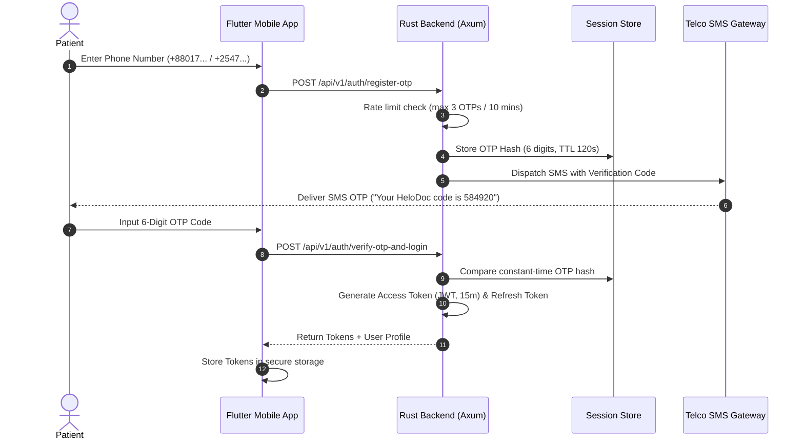
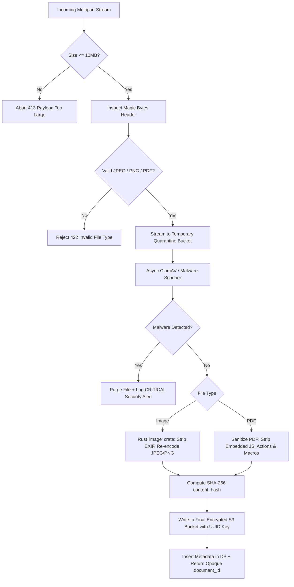

# Phase 8 — Authentication, Authorization & Security Architecture

> **Document Version:** 1.0.0  
> **Security Standards:** HIPAA / GDPR Privacy, OWASP Mobile Top 10, Argon2id Password Hashing, JWT (Ed25519)  
> **Target Audience:** Claude Code Autonomous Implementation Agent

---

## 1. Authentication Lifecycle

### 1.1 Mobile OTP Authentication Flow (Patients)
HelloDoctor uses **Phone Number + OTP** as primary authentication for patients. For physicians, it uses **BMDC Credentials + Password + OTP** (which constitutes a true Multi-Factor Authentication flow).



---

## 2. Token Specifications & Cryptography

### 2.1 Access Tokens
- **Algorithm:** Ed25519 (Asymmetric public/private key signing).
- **Key Generation:** Generated via the `ed25519-dalek` crate.
- **Key Storage:** Must be stored in KMS (Key Management Service) or secure environment variables.
- **Key Rotation:** Managed using the `kid` (Key ID) header with an overlap period for graceful transitions.
- **Verification:** Public key is cached by downstream microservices for stateless validation.
- **Lifespan:** 15 minutes.
- **Payload Schema:**
  ```json
  {
    "sub": "u-c1f7b8a2-9481-4b72-9132-841920842011",
    "role": "PATIENT",
    "permissions": ["appointments:book", "records:read_own", "grievances:create"],
    "iss": "https://api.hellodoctor.asia", // The iss claim must exactly match the production API domain. For staging, use the staging domain.
    "aud": "hellodoctor-mobile",
    "exp": 1790835900,
    "iat": 1790835000
  }
  ```

### 2.2 Auth Sessions & Refresh Tokens
- **Type:** Opaque 64-byte cryptographically secure random hex string.
- **Lifespan:** 7 days.
- **Session Table:** Refresh tokens are bound to a session record in the database, establishing a "token family" concept.
- **Storage:** Only the cryptographic hash of the refresh token is stored in the database, never plaintext.
- **Rotation & Reuse Detection:**
  - Refresh tokens are strictly single-use.
  - When a refresh token is used, it is rotated (a new one is issued) and the old one is invalidated.
  - **Security Rule:** If a previously used (rotated) refresh token is presented, this triggers reuse detection. The system will immediately revoke the entire token family, terminating all active sessions for that device and forcing a re-authentication.

### 2.3 Password Security (Physicians & Administrators)
- **Algorithm:** Argon2id (`argon2` crate in Rust).
- **Parameters:** Memory: 64 MB (`65536`), Iterations: 3, Parallelism: 4.
- **Enforcement:** Minimum 12 characters, uppercase, lowercase, numbers, and symbols. Plaintext passwords must never be logged or transmitted in unencrypted protocols.

---

## 3. Attribute-Based Access Control (ABAC) Matrix

Authorization relies on Attribute-Based Access Control (ABAC). Beyond standard roles, endpoints verify ownership, the active doctor-patient relationship, and the appointment context. Note: All admin roles (PLATFORM_ADMIN, CLINICAL_ADMIN, FINANCE_ADMIN, SUPPORT, COMPLIANCE, SECURITY_ADMIN) are defined in both AUTH_SECURITY and DATABASE_SCHEMA. The legacy generic ADMIN role has been removed to prevent overly broad permission grants.

| Resource / Endpoint | `PATIENT` | `DOCTOR` | Admins (`PLATFORM_ADMIN`, `CLINICAL_ADMIN`, `FINANCE_ADMIN`, `SUPPORT`, `COMPLIANCE`, `SECURITY_ADMIN`) |
|---|---|---|---|
| View Doctor Directory | READ | READ | READ (All Admin Roles) |
| Book Appointment Slot | WRITE (Own) | DENIED | WRITE (`SUPPORT`, `PLATFORM_ADMIN`) |
| Upload Intake Prescriptions | WRITE (Own context) | READ (Assigned context) | READ (`COMPLIANCE`, `CLINICAL_ADMIN`) |
| Author & Sign Prescription | DENIED | WRITE (Assigned context) | READ (`COMPLIANCE`, `CLINICAL_ADMIN`) |
| Inspect Doctor Wallet | DENIED | READ (Own) | READ (`FINANCE_ADMIN`), DISBURSE (`FINANCE_ADMIN`) |
| View Physician Dossier | DENIED | DENIED | READ (`COMPLIANCE`, `PLATFORM_ADMIN`) |
| Submit Clinical Grievance | WRITE (Own) | DENIED | READ (`SUPPORT`, `CLINICAL_ADMIN`) |
| Adjudicate Payment Refund | DENIED | DENIED | WRITE (`FINANCE_ADMIN`, `PLATFORM_ADMIN`) |
| Issue Internal Platform Compliance Warning | DENIED | DENIED | WRITE (`CLINICAL_ADMIN`, `COMPLIANCE`) |
| Subsystem Log Diagnostics | DENIED | DENIED | READ (`SECURITY_ADMIN`, `PLATFORM_ADMIN`) |

*(Note: The 'Subsystem Failure Simulator' is strictly for dev/staging environments and must be stripped from production builds).*

---

## 4. Protected Health Information (PHI) Safeguards

1. **Zero Client Secrets**: The Flutter mobile codebase must never contain embedded API secrets, private encryption keys, or administrative tokens.
2. **Secure Client Storage**:
   - iOS: Apple Keychain via `flutter_secure_storage`.
   - Android: Android Keystore with Hardware-Backed Security (`EncryptedSharedPreferences`).
3. **PHI Caching Rule**:
   - Medical images (like prescriptions or lab reports) must **NOT** be cached by generic disk caching libraries (e.g., `cached_network_image`).
   - Use encrypted, lifecycle-controlled storage with immediate session cleanup upon logout or expiration.
4. **Transport Layer Security**:
   - All REST and WebSocket connections enforce TLS 1.3 with HSTS (`Strict-Transport-Security`).
   - Certificate pinning is enforced on Flutter release builds using `dio` security certificates.

---

## 5. Safe Logging & Telemetry

1. **Safe Logging Rule**:
   - Never dump entire request or response objects into logs.
   - Absolutely no logging of JWTs, Authorization headers, raw refresh tokens, prescription content, uploaded filenames, or PHI elements (e.g., patient name, chief complaint, diagnosis).
   - Use an allow-list approach in the Rust tracing layer (`tracing` crate) with custom formatters to scrub sensitive fields.
2. **Push Notifications**:
   - Push notification payloads must **NEVER** contain diagnoses, prescriptions, patient complaints, or any other PHI.
   - Always use generic messages (e.g., "You have a new message from your doctor" or "Your consultation is ready to begin").

---

## 6. Agora RTC Security

Video consultation channels must be strictly secured to prevent unauthorized access or interception:
- **App Certificate:** The Agora App Certificate must reside on the backend server ONLY and never be shipped in the client.
- **Short-lived Tokens:** RTC tokens are generated on demand and are short-lived, explicitly tied to the duration of the consultation.
- **Channel Authorization:** Channel access is authorized at the backend level; users can only acquire tokens for channels bound to their specific appointments.
- **Unpredictable Identifiers:** Channel names must be unpredictable (e.g., randomized UUIDs, not sequential IDs or easily guessable phone numbers).
- **UID Binding:** Tokens must be explicitly bound to the user's UID to prevent token sharing.
- **Recording Off by Default:** Cloud recording is disabled by default to minimize PHI footprint.
- **Vendor Compliance:** A valid DPA (Data Processing Agreement) and HIPAA/GDPR compliance contract with Agora must be maintained.

---

## 7. Anti-Injection Architecture (Zero-Tolerance Policy)

HelloDoctor eliminates code and data injection vectors by design across all system layers:

### 7.1 SQL Injection Elimination
- **Compile-Time Verification:** All SQL queries in Rust Axum services must be authored using `sqlx::query!` or `sqlx::query_as!`. String concatenation or runtime string formatting (`format!`) for SQL construction is strictly rejected by CI lint rules (`clippy::disallowed_methods`).
- **Parameterized Binding:** All parameters are bound as typed variables (`$1`, `$2`) with strict Rust types (`Uuid`, `BigDecimal`, `chrono::DateTime`, domain Enums).
- **PostgreSQL Cast Enforcement:** Database inputs are cast at query boundaries, ensuring malformed literals trigger database parse rejections rather than execution.

### 7.2 Cross-Site Scripting (XSS) Prevention
- **Mobile Layer:** Flutter natively renders UI via Skia/Impeller canvas and text spans without an HTML/DOM document tree, immunizing the mobile app against script injection.
- **Admin Web Shell (Next.js):**
  - Strict Content Security Policy (CSP): `default-src 'self'; script-src 'self'; object-src 'none'; style-src 'self' 'unsafe-inline'; base-uri 'none'; frame-ancestors 'none';`.
  - Zero `dangerouslySetInnerHTML` usage.
  - Automated input sanitization on all clinical notes and free-text inputs.

### 7.3 Command & Process Injection
- **No Subprocess Execution:** Invocation of shell binaries (`std::process::Command`, `sh`, `bash`) is forbidden in the backend. All integrations (malware scans, image re-encoding, PDF parsing) use memory-safe, pure-Rust or native C-FFI libraries directly in process memory.

### 7.4 Server-Side Request Forgery (SSRF)
- **Zero Arbitrary URL Fetching:** The backend never downloads or fetches arbitrary URLs supplied by patients or doctors.
- **Webhook Hardening:** Payment callbacks (`/api/v1/webhooks/payment/{provider}`) validate origin against static IP CIDR allowlists and verify HMAC-SHA256 request signatures before processing payloads.

### 7.5 Path Traversal & Object Injection
- **Opaque Storage Keys:** User-provided filenames are completely discarded. Object storage keys are generated server-side using UUIDv7 timestamps:
  ```rust
  let object_key = format!("rx/{}/{}.jpg", appointment_id, Uuid::now_v7());
  ```
- **Storage Isolation:** Files are written to isolated S3/MinIO buckets without local filesystem exposure.

---

## 8. API Key & Credential Protection Architecture

1. **Zero Client Secrets:** The Flutter client codebase and Web admin build bundle zero API secrets. No AWS S3 secret keys, Agora App Certificates, SMS gateway tokens, or payment gateway API secrets exist on client devices.
2. **Backend Secrets Management:**
   - Secrets are loaded at runtime from environment variables injected by secure secret managers (e.g., AWS Secrets Manager, HashiCorp Vault, or Doppler).
   - In-memory secrets (JWT signing keys, database passwords) use the `secrecy` crate with `SecretString` to ensure zeroization upon drop and prevention of accidental logging.
3. **Key Rotation & Asymmetric Signatures:**
   - Access tokens use asymmetric **Ed25519** signing: private keys exist only on the authentication service; public keys are distributed for stateless verification with `kid` (Key ID) header rotation.

---

## 9. Multi-Tier Rate Limiting & Form Abuse Defense

To prevent brute force, denial of wallet attacks, and resource exhaustion, HelloDoctor deploys a multi-tier sliding-window token bucket algorithm powered by Redis and Axum Tower middleware:

```
┌─────────────────────────────────────────────────────────────────────────────┐
│                            RATE LIMITING MATRIX                             │
├─────────────────────────┬──────────────────────────────┬────────────────────┤
│ Scope / Route           │ Limit & Window               │ Action on Breach   │
├─────────────────────────┼──────────────────────────────┼────────────────────┤
│ Global IP Rate Limit    │ 120 requests / minute / IP   │ 429 Too Many Req   │
├─────────────────────────┼──────────────────────────────┼────────────────────┤
│ Patient OTP Request     │ 3 requests / 10 min / phone  │ 429 (Cooldown 60s) │
├─────────────────────────┼──────────────────────────────┼────────────────────┤
│ Doctor Password Auth    │ 5 attempts / 15 min / IP     │ Temporary Lockout  │
├─────────────────────────┼──────────────────────────────┼────────────────────┤
│ Appointment Booking     │ 10 bookings / hour / user    │ 429 Slot Throttled │
├─────────────────────────┼──────────────────────────────┼────────────────────┤
│ File Upload Intake      │ 10 files / 10 min / user     │ 429 Upload Blocked │
├─────────────────────────┼──────────────────────────────┼────────────────────┤
│ Grievance Submission    │ 3 grievances / day / user    │ 429 Report Limit   │
└─────────────────────────┴──────────────────────────────┴────────────────────┘
```

- **Idempotency Header Defense:**
  - All mutating financial, booking, and upload endpoints enforce `Idempotency-Key: <UUID>`.
  - Duplicate requests within the key window return the cached response without re-triggering business logic, preventing double-form submission or network retry storms.

---

## 10. Call / Video & SMS / Text Abuse Mitigation

### 10.1 SMS / Telco Cost Bleed Protection
1. **Per-Phone Cooldown:** Minimum 60-second enforced wait before an OTP resend can be dispatched to the same phone number.
2. **Daily Phone Cap:** Maximum 10 OTP dispatches per phone number in any 24-hour sliding window.
3. **Global Telco Velocity Breaker:** If outbound SMS volume exceeds 5x baseline within 5 minutes, an automated circuit breaker activates, switching secondary attempts to CAPTCHA/Turnstile verification and notifying the on-call engineer.

### 10.2 Agora Video Room & Token Abuse
1. **Appointment Validation:** Tokens are minted strictly if appointment status is `CONFIRMED` or `IN_CONSULTATION`.
2. **Temporal Window Gate:** Mints are accepted only within the scheduled consultation window:
   $$\text{Slot Start} - 10\text{ min} \le \text{Current Time} \le \text{Slot End} + 15\text{ min}$$
3. **Role & UID Lockdown:** The token binds `uid` and `agora_channel_name`. A patient cannot masquerade as a doctor, and third parties cannot join unauthorized rooms.
4. **Active Call Enforcer:** An Agora Webhook listener monitors session duration. If a room remains open past 30 minutes, the server dispatches a channel kick command via Agora REST API.

---

## 11. Upload Security & Malware Quarantine Pipeline

Every uploaded file (patient intake photo, doctor handwritten prescription photo, lab PDF) must traverse an end-to-end security pipeline:



- **Forbidden Formats:** SVGs, HTML files, `.exe`, `.sh`, `.php`, `.bat`, `.zip`, `.js` disguised as images are unconditionally rejected at the magic-byte inspection layer.
- **Zero Direct URLs:** The database only stores `object_bucket` and `object_key`. Clients never receive static URLs. Download access requires an authenticated call to `/api/v1/appointments/{id}/documents/{doc_id}`, which validates ABAC permissions and returns a pre-signed URL expiring in 300 seconds.

---

## 12. PostgreSQL Row-Level Security (RLS) Implementation

To ensure defense-in-depth even if an application-level query omits an ownership filter, PostgreSQL Row-Level Security is enabled and enforced:

1. **Transactional Session Context:**
   Every Axum database transaction begins by binding local session variables:
   ```sql
   SET LOCAL app.current_user_id = '$USER_UUID';
   SET LOCAL app.current_role = '$USER_ROLE';
   ```
   Because `SET LOCAL` is scoped strictly to the current transaction, connection reuse in `sqlx::PgPool` cannot leak credentials to subsequent requests.
2. **Forced Security:**
   All PHI tables execute `ALTER TABLE <table> FORCE ROW LEVEL SECURITY;`, ensuring table owners and administrative database roles are also bound by RLS rules.
3. **Defense-in-Depth Principle:**
   Application ABAC is authoritative; database RLS ensures that any accidental query flaw or compromised route handler physically cannot select, update, or delete rows outside the caller's tenancy.

