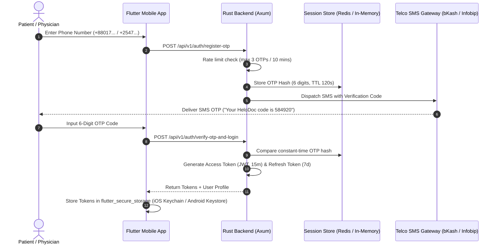

# Phase 8 — Authentication, Authorization & Security Architecture

> **Document Version:** 1.0.0  
> **Security Standards:** HIPAA / GDPR Privacy, OWASP Mobile Top 10, Argon2id Password Hashing, JWT (RS256/Ed25519)  
> **Target Audience:** Claude Code Autonomous Implementation Agent

---

## 1. Authentication Lifecycle

### 1.1 Multi-Factor Mobile Authentication Flow
HelloDoctor uses **Phone Number + OTP** as primary patient authentication and **BMDC Credentials + Password + OTP** for physicians.



---

## 2. Token Specifications & Cryptography

### 2.1 Access Tokens
- **Algorithm:** RS256 or Ed25519 (Asymmetric public/private key signing).
- **Lifespan:** 15 minutes.
- **Payload Schema:**
  ```json
  {
    "sub": "u-c1f7b8a2-9481-4b72-9132-841920842011",
    "role": "PATIENT",
    "permissions": ["appointments:book", "records:read_own", "grievances:create"],
    "iss": "https://api.hellodoctor.com",
    "aud": "hellodoctor-mobile",
    "exp": 1790835900,
    "iat": 1790835000
  }
  ```

### 2.2 Refresh Tokens
- **Type:** Opaque 64-byte cryptographically secure random token (`hex::encode(rand::thread_rng().gen::<[u8; 32]>())`).
- **Lifespan:** 7 days.
- **Rotation:** Refresh tokens are single-use. Each rotation invalidates the prior token and issues a new pair.

### 2.3 Password Security (Physicians & Administrators)
- **Algorithm:** Argon2id (`argon2` crate in Rust).
- **Parameters:** Memory: 64 MB (`65536`), Iterations: 3, Parallelism: 4.
- **Enforcement:** Minimum 12 characters, uppercase, lowercase, numbers, and symbols. Plaintext passwords must never be logged or transmitted in unencrypted protocols.

---

## 3. Role-Based Access Control (RBAC) Matrix

| Resource / Endpoint | `PATIENT` | `DOCTOR` | `ADMIN` |
|---|---|---|---|
| View Doctor Directory (`GET /api/v1/doctors`) | READ | READ | READ |
| Book Appointment Slot (`POST /api/v1/appointments/book`) | WRITE (Own) | DENIED | ADMIN OVERRIDE |
| Upload Intake Prescriptions (1–5 photos) | WRITE (Own) | READ (Assigned) | READ (Audit) |
| Author & Sign Prescription (`POST /prescriptions`) | DENIED | WRITE (Assigned) | READ (Audit) |
| Inspect Doctor Wallet & Debarred 20% Fees | DENIED | READ (Own) | READ / DISBURSE |
| View Physician Dossier (Phone & Residence) | DENIED | DENIED | FULL ACCESS |
| Submit Clinical Grievance | WRITE (Own) | DENIED | READ |
| Adjudicate Escrow Refund (`POST /grievances/{id}/refund`) | DENIED | DENIED | FULL EXECUTE |
| Issue BMDC Disciplinary Warning | DENIED | DENIED | FULL EXECUTE |
| Subsystem Log Diagnostics & Failure Simulator | DENIED | DENIED | FULL EXECUTE |

---

## 4. Protected Health Information (PHI) Safeguards

1. **Zero Client Secrets**: The Flutter mobile codebase must never contain embedded API secrets, private encryption keys, or administrative tokens.
2. **Secure Client Storage**:
   - iOS: Apple Keychain via `flutter_secure_storage`.
   - Android: Android Keystore with Hardware-Backed Security (`EncryptedSharedPreferences`).
3. **Data Masking in Logs**:
   - The Rust tracing layer (`tracing` crate) must implement custom formatters to scrub sensitive fields (`phone_number`, `password`, `patient_name`, `diagnosis_notes`, `chief_complaint`).
4. **Transport Layer Security**:
   - All REST and WebSocket connections enforce TLS 1.3 with HSTS (`Strict-Transport-Security`).
   - Certificate pinning is enforced on Flutter release builds using `dio` security certificates.
