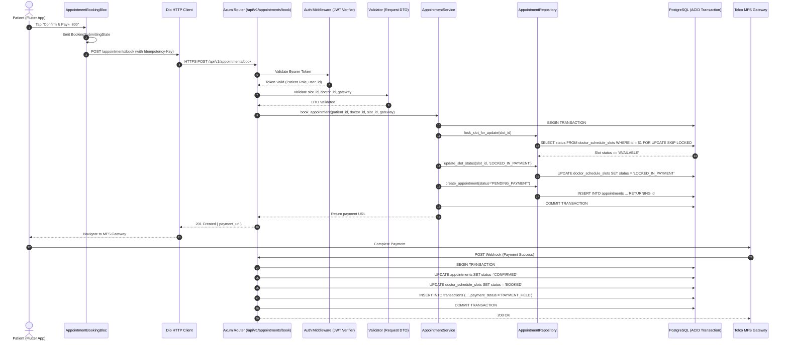
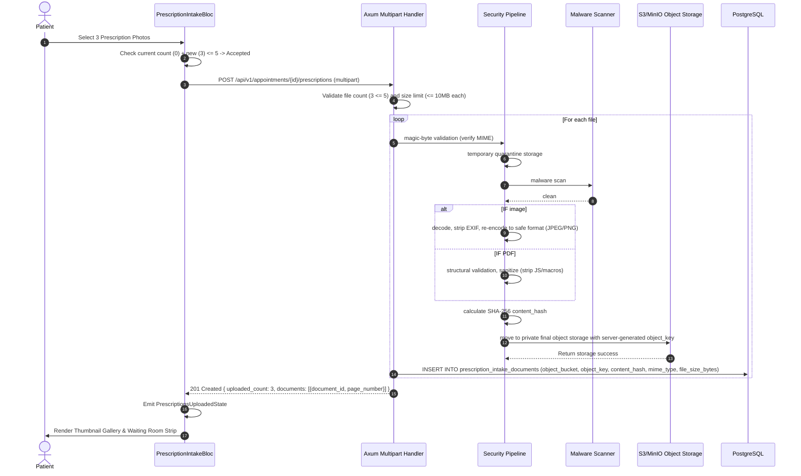
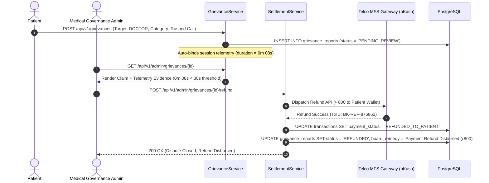
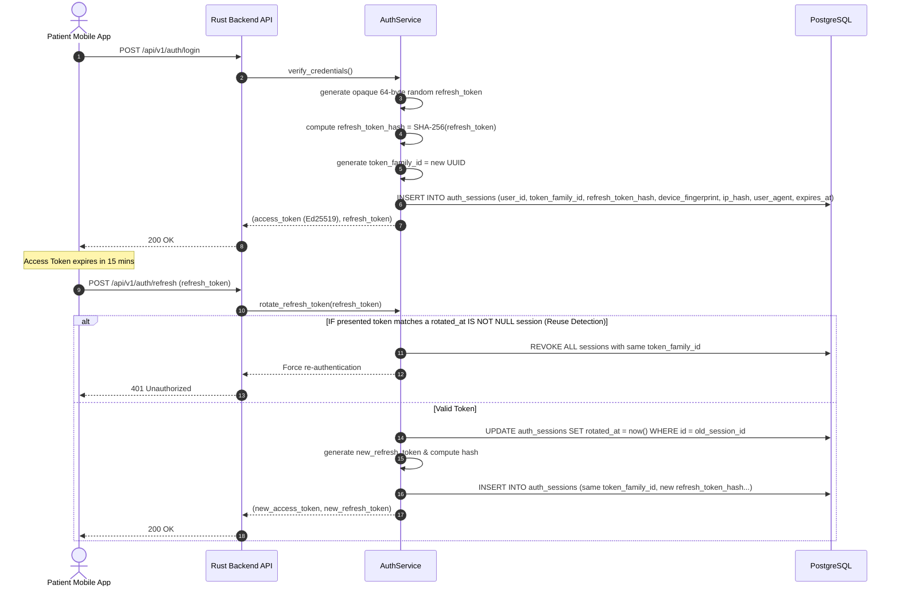

# Phase 29 — End-to-End System Data Flow Architecture

> **Document Version:** 1.0.0  
> **Flow Paradigm:** User Action ──> Flutter BLoC ──> Dio Client ──> Rust Axum Router ──> Auth Middleware ──> Validation ──> Domain Service ──> SQLx Repository ──> PostgreSQL ──> Response ──> BLoC State ──> UI Update  
> **Target Audience:** Claude Code Autonomous Implementation Agent

---

## 1. Flow 1: Slot Booking & Payment Hold



---

## 2. Flow 2: Multi-Prescription Intake Upload (1–5 Photos)



---

## 3. Flow 3: Telehealth Session & Telemetry Capture (Agora RTC)

```mermaid
sequenceDiagram
    autonumber
    actor Doctor as Doctor Workstation
    actor Patient as Patient Mobile App
    participant Axum as Rust Backend API
    participant Agora as Agora SD-RTN Global Network
    participant TelemetrySvc as TelemetryService
    participant CompSvc as Consultation Completion Service
    participant SettlementSvc as SettlementService
    participant DB as PostgreSQL

    Patient->>Axum: POST /api/v1/consultations/{appointment_id}/rtc-token
    Doctor->>Axum: POST /api/v1/consultations/{appointment_id}/rtc-token
    Axum-->>Patient: 200 OK (Agora Token, Channel: rtc_7baf3072_96bd_4fae_a735_e8d2c1f94b3a, UID: 94812)
    Axum-->>Doctor: 200 OK (Agora Token, Channel: rtc_7baf3072_96bd_4fae_a735_e8d2c1f94b3a, UID: 10421)
    Patient->>Agora: joinChannel(token, "rtc_7baf3072_96bd_4fae_a735_e8d2c1f94b3a", 94812)
    Doctor->>Agora: joinChannel(token, "rtc_7baf3072_96bd_4fae_a735_e8d2c1f94b3a", 10421)
    Note over Patient,Doctor,Agora: Adaptive 720p/1080p Video via Agora SD-RTN
    Note over Patient: Agora RtcStats tracks callSeconds, packetLoss, RTT
    Doctor->>Agora: leaveChannel()
    Note over Doctor: Writes prescription on paper & takes photo
    Doctor->>Axum: POST /api/v1/consultations/{appointment_id}/prescription (multipart photo)
    Axum->>SecPipe: magic-byte validation, malware scan, EXIF stripping
    SecPipe->>S3: move to private final object storage with rx_image_object_key
    SecPipe->>SecPipe: calculate SHA-256 integrity_verification_hash
    Axum->>DB: INSERT INTO prescriptions (rx_image_object_key, integrity_verification_hash...)
    Axum-->>Doctor: 201 Created (Photo delivered to Patient Health Vault)
    
    Patient->>TelemetrySvc: POST /api/v1/consultations/{appointment_id}/telemetry (from onRtcStats)
    Note over TelemetrySvc: Payload: call_duration = 642s, packet_loss = 0.4%, premature_end = false
    TelemetrySvc->>DB: record technical evidence only (INSERT INTO consultation_telemetry)
    
    Note over CompSvc: Triggered on Session End / Consultation Completion
    CompSvc->>CompSvc: verify appointment state = IN_CONSULTATION
    CompSvc->>CompSvc: verify server-side timestamps (minimum session duration)
    CompSvc->>CompSvc: verify clinical_outcome is set
    CompSvc->>CompSvc: verify no blocking grievance/dispute
    CompSvc->>SettlementSvc: trigger_settlement()
    SettlementSvc->>DB: UPDATE transactions SET payment_status = 'SETTLED_TO_DOCTOR'
    Note over SettlementSvc: SETTLED_TO_DOCTOR means earmarked for doctor, pending monthly batch payout
    SettlementSvc->>DB: INSERT INTO payment_events (event_type = 'SETTLED')
    DB-->>Patient: 200 OK -> Navigate to View-11 Post-Consultation
```

---

## 4. Flow 4: Clinical Grievance Adjudication & Payment Refund



---

## 5. Flow 5: Auth Session Lifecycle


