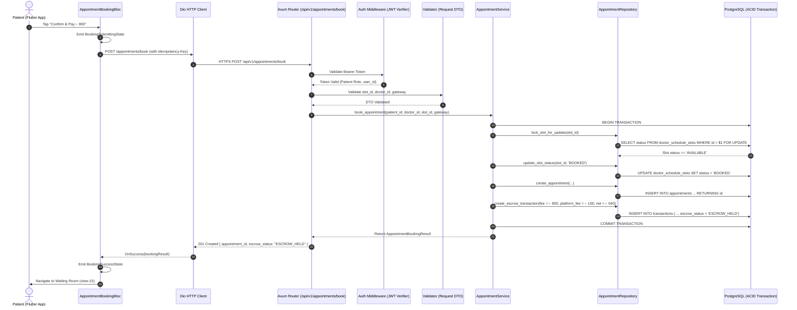
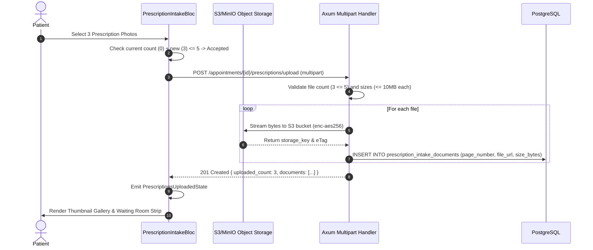

# Phase 29 — End-to-End System Data Flow Architecture

> **Document Version:** 1.0.0  
> **Flow Paradigm:** User Action ──> Flutter BLoC ──> Dio Client ──> Rust Axum Router ──> Auth Middleware ──> Validation ──> Domain Service ──> SQLx Repository ──> PostgreSQL ──> Response ──> BLoC State ──> UI Update  
> **Target Audience:** Claude Code Autonomous Implementation Agent

---

## 1. Flow 1: Slot Booking & Escrow Hold



---

## 2. Flow 2: Multi-Prescription Intake Upload (1–5 Photos)



---

## 3. Flow 3: Telehealth Session & Telemetry Capture (Agora RTC)

```mermaid
sequenceDiagram
    autonumber
    actor Doctor as Doctor Workstation
    actor Patient as Patient Mobile App
    participant Axum as Rust Backend API
    participant Agora as Agora SD-RTN Global Network
    participant TelemetrySvc as TelemetryService
    participant DB as PostgreSQL

    Patient->>Axum: POST /api/v1/telehealth/agora-token (appointment_id)
    Doctor->>Axum: POST /api/v1/telehealth/agora-token (appointment_id)
    Axum-->>Patient: 200 OK (Agora Token, Channel: apt-94812, UID: 94812)
    Axum-->>Doctor: 200 OK (Agora Token, Channel: apt-94812, UID: 10421)
    Patient->>Agora: joinChannel(token, "apt-94812", 94812)
    Doctor->>Agora: joinChannel(token, "apt-94812", 10421)
    Note over Patient,Doctor,Agora: Adaptive 720p/1080p Video via Agora SD-RTN
    Note over Patient: Agora RtcStats tracks callSeconds, packetLoss, RTT
    Doctor->>Agora: leaveChannel() & Sign Prescription
    Patient->>TelemetrySvc: POST /consultations/{id}/telemetry (from onRtcStats)
    Note over TelemetrySvc: Payload: call_duration = 642s, packet_loss = 0.4%, premature_end = false
    TelemetrySvc->>DB: INSERT INTO consultation_telemetry (...)
    TelemetrySvc->>DB: UPDATE transactions SET escrow_status = 'SETTLED_TO_DOCTOR'
    DB-->>Patient: 200 OK -> Navigate to View-11 Post-Consultation
```

---

## 4. Flow 4: Clinical Grievance Adjudication & Escrow Refund


