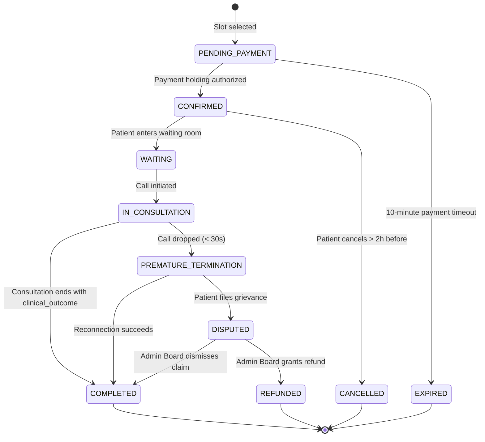
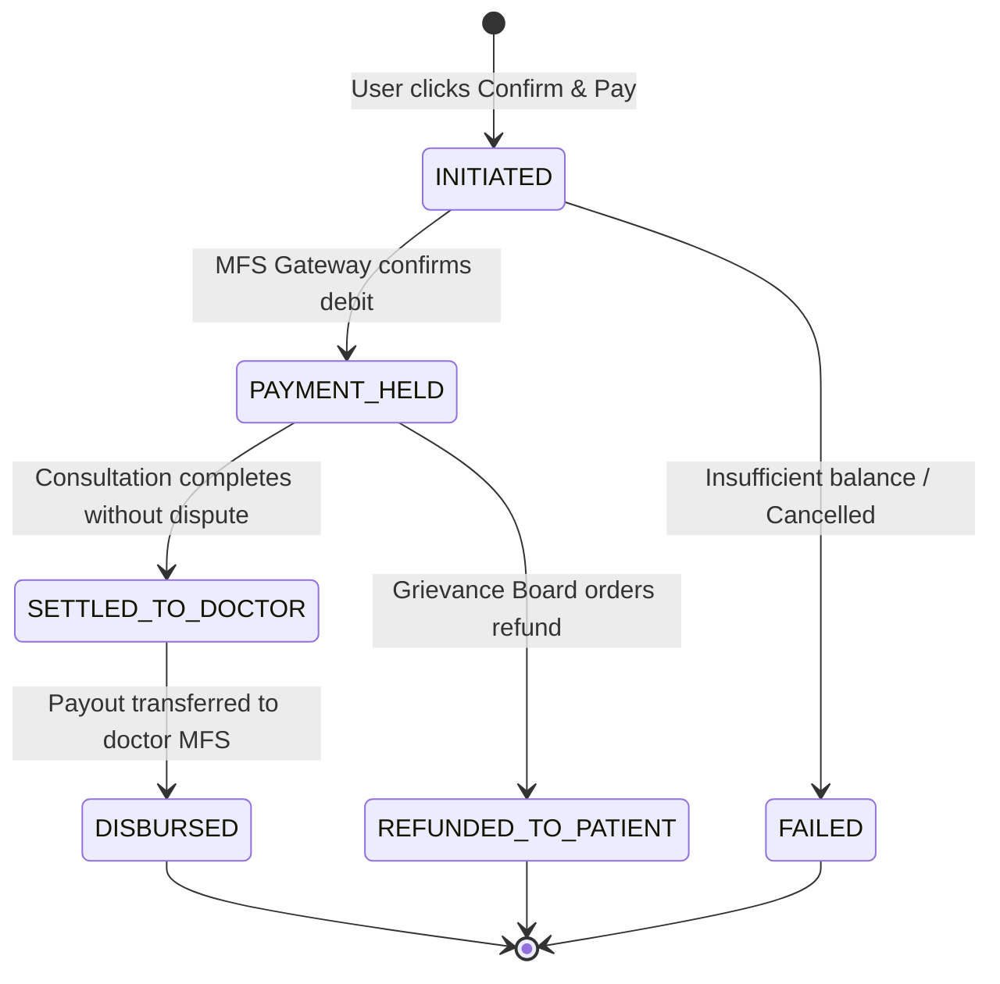
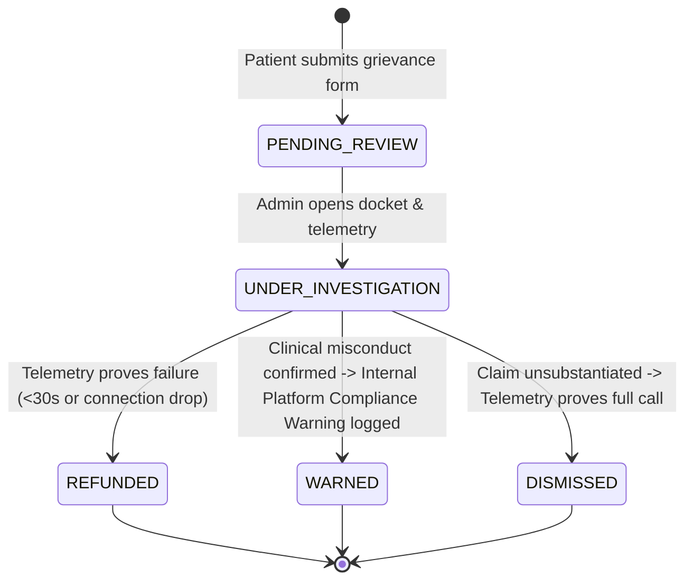
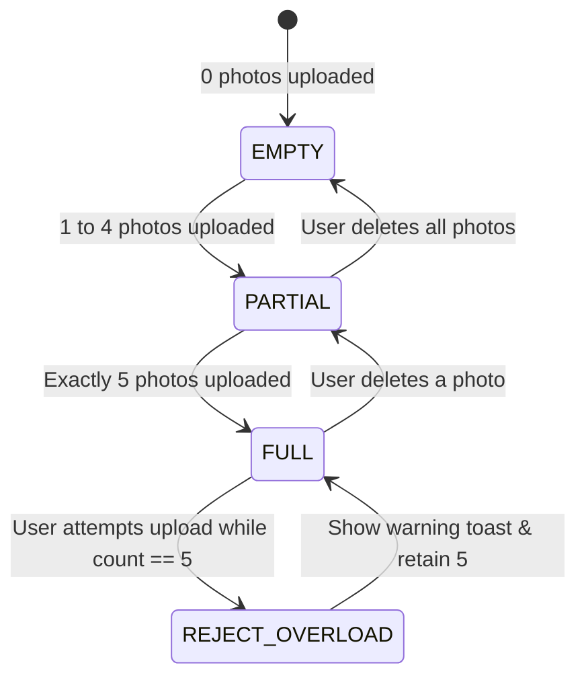
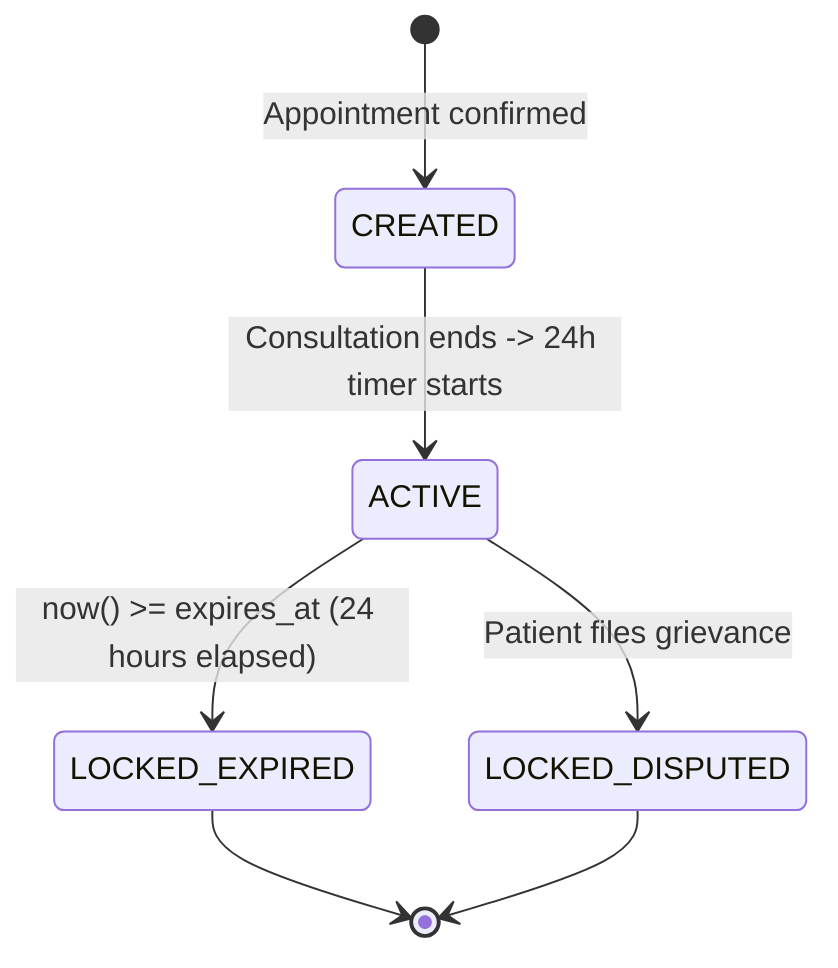

# Phase 14 — Formal State Machines & Lifecycle Specifications

> **Document Version:** 1.0.0  
> **Engine:** Deterministic Finite State Automata (FSA)  
> **Target Audience:** Claude Code Autonomous Implementation Agent

---

## 1. Overview & Transition Integrity

To prevent invalid clinical or financial states (e.g., releasing funds before consultation or editing prescriptions after signing), all stateful entities must enforce strict transition matrices with pre-condition guards.

---

## 2. Core State Machines

### 2.1 `AppointmentState`
Controls the lifecycle of a patient's booking.

- **Valid Transitions & Guards:**
  - `PENDING_PAYMENT -> CONFIRMED`: Guarded by verified MFS IPN webhook or gateway token.
  - `PENDING_PAYMENT -> EXPIRED`: Auto-triggered by background job after 600 seconds. Releases slot back to `AVAILABLE`.
  - `IN_CONSULTATION -> COMPLETED`: Guarded by the presence of a set `clinical_outcome` and writes `completed_at = CURRENT_TIMESTAMP`. Note: A prescription is NOT required to complete an appointment, only an outcome. Doctor clinical access expires 24 hours after `completed_at`.
  - `CONFIRMED -> CANCELLED`: Guarded by `appointment_time - now() > 2 hours`. Full refund returned to patient.

---

### 2.2 `PaymentStatusState`
Controls financial holding and settlement under the 20% platform charge model.

- **Settlement Transition (`PAYMENT_HELD -> SETTLED_TO_DOCTOR`):**
  - Gross Inflow: $G$
  - HeloDoc Platform Fee: $C = G \times 0.20$ (Credited to platform revenue ledger)
  - Doctor Net Settlement: $N = G \times 0.80$ (Credited to `doctor_wallets.pending_disbursement` until the Finance-admin batch)

---

### 2.3 `GrievanceState`
Controls patient dispute resolution and Central Medical Governance Board arbitration.

---

### 2.4 `PrescriptionUploadState` (Max 5 Images)
Controls pre-consultation multi-prescription intake.

---

### 2.5 `ChatConversationState` (24-Hour Clinical Desk)

