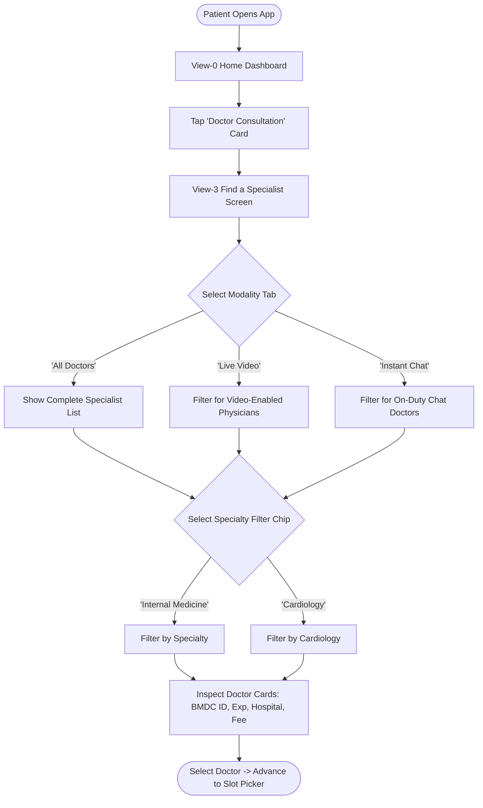
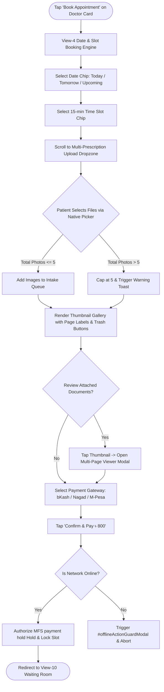
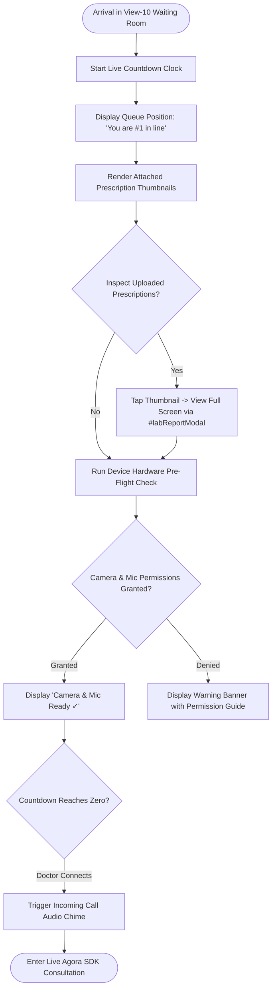
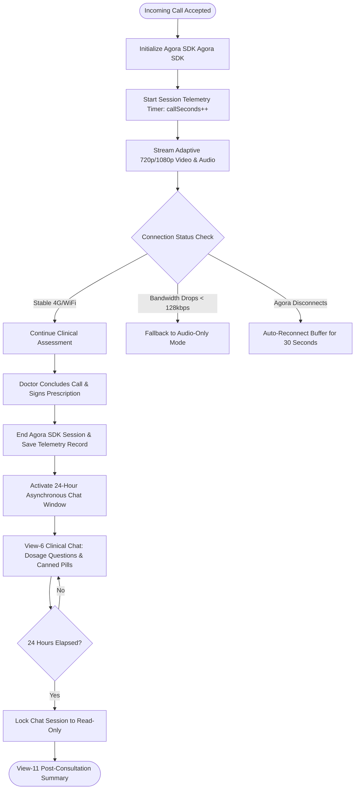
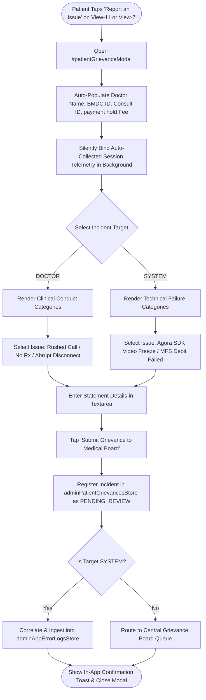
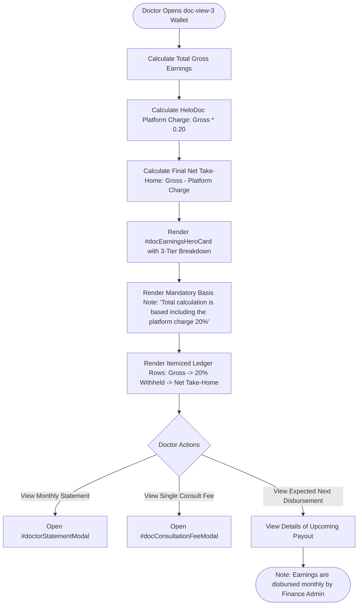
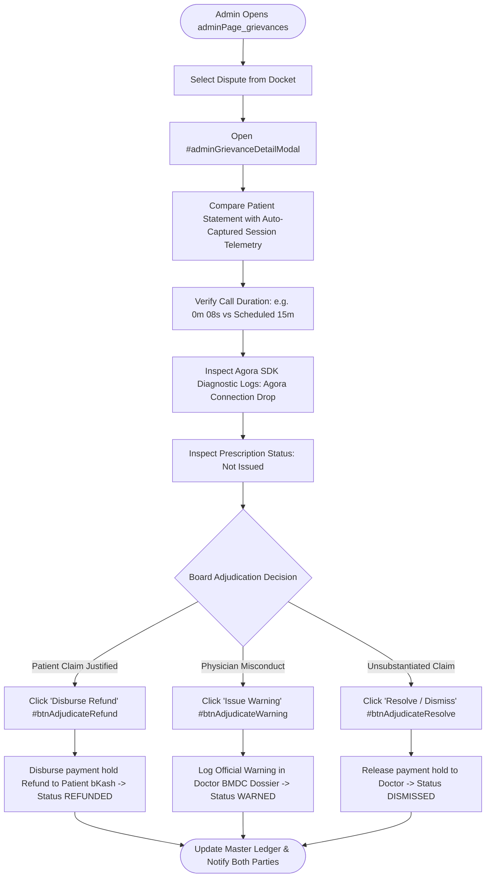

# Phase 3 — End-to-End User Journeys & Reverse-Engineered Flows

> **Document Version:** 1.0.0  
> **Source Baseline:** `index.html` (and `prototype/index.html`)  
> **Target Audience:** Claude Code Autonomous Implementation Agent

---

## 1. Flow Overview & Architectural Classification

This document reverse-engineers all user journeys found in the HelloDoctor platform. Every flow is defined with state transitions, decision points, alternate branches, and error-recovery paths.

Format standard:
`START` ──> `STEP` ──> `DECISION` ──> `ACTION` ──> `RESULT`

---

## 2. Patient Journeys

### FLOW-PATIENT-001: Specialist Discovery & Modality Filtering

- **Happy Path:** Patient selects modality tab, taps specialty chip (e.g., "Internal Medicine"), browses doctor cards displaying verified BMDC numbers and fees, and taps "Book Appointment".
- **Alternate Path:** Patient taps on doctor card directly to view full qualifications in `view-9` (Doctor Profile) before booking.
- **Empty State:** If no physicians match the filter, the view displays: *"No specialists available for the selected criteria."*
- **Offline State:** Intercepted by `#patientOfflineBanner`; cached doctor directory is shown with a *"Reconnecting..."* status badge.

---

### FLOW-PATIENT-002: Appointment Booking, Multi-Rx Upload (1–5 Photos) & payment hold Payment

- **Validation Rules:**
  - Date and time slot selection are mandatory before payment is enabled.
  - Image upload accepts `image/*,application/pdf` with a hard limit of 5 photos (`MAX_PRESCRIPTION_IMAGES = 5`).
  - Excess photos are truncated, and the user receives a warning toast: *"Maximum 5 prescription photos allowed. Extra photos were omitted."*
- **Payment payment hold Rule:** Funds are placed into `PAYMENT_HELD` in `adminTransactionStore`. The consulting doctor does not receive a balance credit until clinical consultation completes without dispute.

---

### FLOW-PATIENT-003: Virtual Waiting Room & Pre-Flight Device Check

- **Document Review:** Patient can paginate through their uploaded prescriptions (pages 1 to 5) using `#btnPrevRxPage` and `#btnNextRxPage`.
- **Doctor Delay Handling:** If the physician is delayed by > 5 minutes, an informative status card advises the patient: *"Your doctor is finishing an urgent clinical case. Please stay on this screen."*

---

### FLOW-PATIENT-004: Live Agora SDK Teleconsultation & 24h Follow-up Chat

- **Telemetry Auto-Capture:** Every session records actual connected duration (`callSeconds`), Agora connection state, and prescription generation state.
- **Premature Call Drop:** If the call terminates under 30 seconds (`callSeconds < 30`), the session is automatically tagged with `prematureEnd: true`, keeping funds in payment hold pending patient reconnection or grievance filing.

---

### FLOW-PATIENT-005: Clinical Grievance Redressal (Star-Rating-Free Adjudication)

- **Zero Star Ratings:** No star rating or public review interface is presented.
- **Privacy Rule:** Raw telemetry metrics (`pgmTelemetryInspector`, `v11TelemetryCard`) are marked with `style="display:none;" aria-hidden="true"`, remaining hidden from the patient while providing the Medical Board with full forensic visibility.
- **Governance Rule:** Patients describe their experience and provide notes, but cannot assign punitive remedies; resolution is reserved for Central Board adjudication.

---

### FLOW-PATIENT-006: Emergency Contact Helpline (Call 16263)
```mermaid
flowchart TD
    START([Patient in Medical Distress Launches App]) --> A[View-0 Home Dashboard]
    A --> B[Emergency Contact Banner Located Directly Above Upcoming Appointments]
    B --> C[Verify Banner Label: 'Emergency Contact' (No '24/7' prefix)]
    C --> D[Tap 'Call 16263' Button]
    D --> E[Trigger System URL Scheme: tel:16263]
    E --> RESULT([Native Phone Dialer Connects to National Emergency Triage])
```

---

### FLOW-PATIENT-007: Bilingual Localization (English & Swahili)
```mermaid
flowchart TD
    START([Patient Opens View-7 Account Settings]) --> A[Tap 'Language (English / Swahili)' Menu Item]
    A --> B[Open #languageModal]
    B --> C{Select Language Option}
    C -- 'English' --> D[Highlight English Checkmark]
    C -- 'Swahili (Kiswahili)' --> E[Highlight Swahili Checkmark]
    D & E --> F[Tap 'Apply Language']
    F --> G[Update localStorage with Language Code]
    G --> H[Update UI Labels & dynamic badge #patientActiveLangBadge]
    H --> RESULT([Display Bilingual Confirmation Toast])
```

---

## 3. Doctor Journeys

### FLOW-DOC-001: Doctor Queue Triage & Duty Toggle
- **Trigger:** Doctor logs in or opens `doc-view-0`.
- **Duty Toggle:** Doctor toggles the on-duty switch (`toggleDoctorDuty()`). The backend updates physician availability status and begins routing incoming consultations.
- **Queue Review:** Doctor reviews the queue list sorted by appointment time, inspects patient age, reported symptoms, and checks for attached multi-prescription photos.

---

### FLOW-DOC-002: Prescription Photo Upload & E-Prescription Dispatch
- **Step 1:** In `doc-view-1`, the doctor selects an active patient from queue pills.
- **Step 2:** Doctor inspects attached patient documents using the multi-page previewer.
- **Step 3:** Doctor conducts the consultation, then writes the prescription on paper.
- **Step 4:** Doctor takes a photo of the handwritten prescription with their phone/webcam and uploads it via the app. (Alternatively, if no prescription is needed, Doctor taps 'Complete Without Prescription', enters a brief reason, and the consultation is marked as COMPLETED_NO_RX).
- **Step 5:** Doctor clicks "Upload & Dispatch".
- **Result:** The system processes the photo through the security pipeline (malware scan, EXIF stripping), saves it to S3, computes an integrity hash, and delivers the photo to the patient's Health Vault (`view-5`). This unlocks the 24-hour follow-up chat window.

---

### FLOW-DOC-003: Doctor Earnings & 20% Debarred Settlement


---

## 4. Central Administration Journeys

### FLOW-ADMIN-001: Doctor Dossier Review (Contact & History)
- **Step 1:** Administrator opens `adminPage_doctors`.
- **Step 2:** Locates physician record (e.g., Dr. Anika Rahman, BMDC #52891).
- **Step 3:** Clicks "View Dossier", opening `#adminDoctorHistoryModal`.
- **Step 4:** Administrator inspects verified contact information:
  - **Phone Number:** `+880 1711-884920`
  - **Residential Address:** `Dhanmondi, Dhaka (House 42, Road 7A)`
  - **Official Email:** `dr.anika.dmch@helodoc.com`
  - **Consultation History & Past Disciplinary Warnings**.

---

### FLOW-ADMIN-002: Grievance Adjudication & Dispute Settlement


---

### FLOW-ADMIN-003: Subsystem Diagnostics & Failure Simulation
- **Step 1:** Administrator opens `adminPage_logs`.
- **Step 2:** Filters logs by subsystem (`MFS_BKASH_GATEWAY`, `AGORA_RTC`, `DGDA_EMR_SYNC`).
- **Step 3:** Clicks trace ID (e.g., `TRC-94812-BKASH`) to inspect error stack trace in `#adminLogDetailModal`.
- **Step 4:** To test system resilience, clicks "Simulate Failure", opening `#adminSimulateFailureModal`.
- **Step 5:** Selects scenario (e.g., *bKash IPN Webhook Timeout*), sets severity (*CRITICAL*), and clicks "Execute Simulation".
- **Result:** System simulates the incident, verifies that user-facing error banners display properly, and logs the incident in the audit trail without disrupting live production traffic.

---

### FLOW-ADMIN-004: Monthly Payment Disbursement
- **Step 1:** Administrator opens `adminPage_finance`.
- **Step 2:** Clicks "Initiate Monthly Disbursement".
- **Step 3:** Selects date range (e.g., Previous Month).
- **Step 4:** System groups all unsettled `SETTLED_TO_DOCTOR` transactions, calculates totals per doctor.
- **Step 5:** Admin confirms batch. Payouts are dispatched to doctors' MFS accounts. Doctor wallets are updated with `last_disbursement_at` and `last_disbursement_amount`.
